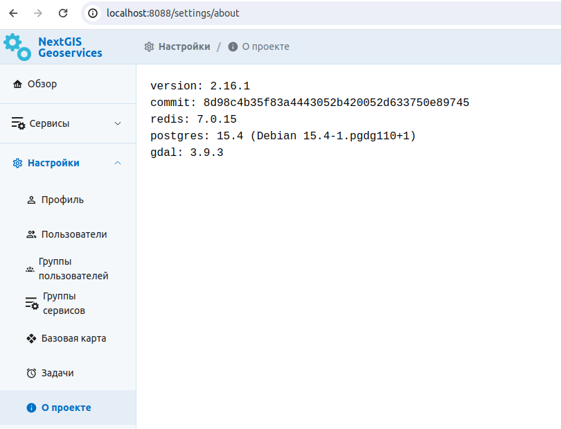

.. _docs_geoserv_prem_admin:

Установка GeoServices (инструкция для администратора)
=====================================================

В настоящей инструкции приведен порядок развертывания ПО NextGIS GeoServices. В качестве преимущественного способа развертывания и работы ПО предполагается использование технологии Docker и средство docker-compose. Все шаги необходимо выполнять в ОС на базе Linux.

.. _nggs_prem_admin_address:

Выбор адресов подключения
------------------------------

NextGIS GeoServices использует одну точку подключения по HTTP (или HTTPS). Веб-интерфейс NextGIS GeoServices и API - основной адрес по которому пользователи взаимодействуют с продуктом. Значение по умолчанию -  http://server.example.com:8088, где server.example.com DNS-имя сервера, на котором развернут продукт. В крайнем случае вместо server.example.com можно использовать IP-адрес сервера.

Если ваша ИТ-инфраструктура позволяет, рекомендуется настроить обратный прокси-сервер (reverse proxy) для обеспечения TLS-шифрования и работы через HTTPS. Это особенно важно, если доступ к продукту будет осуществляться не только из локальной сети, но и через Интернет. В этом случае адреса точек подключения зависят от настроек обратного прокси-сервера.

Совместно с вашим ИТ-департаментом и выберите адреса, которые вы хотите использовать и запишите их, они потребуются в дальнейшем. Настройка обратного прокси-сервера должна выполняется силами ИТ-департамента клиента и не относится к области ответственности компании NextGIS. Необходимые параметры приведены `ниже на примере Nginx <https://docs.nextgis.ru/docs_geoserv_prem/source/admin.html#nggs-prem-admin-proxy>`_.

.. _nggs_prem_admin_docker:

Установка и настройка Docker
---------------------------------

.. important:: Все шаги в этом разделе должны выполняться с правами    суперпользователя (``root``). Если вы используете ``sudo``, то чтобы    не запутаться в командах, рекомендуется сначала выполнить ``sudo -i``    для получения полноценной сессии суперпользователя.

Если на сервере еще не установлен Docker Engine и Docker Compose их нужно установить или обновить до актуальных версий:

* `Docker Engine <https://docs.docker.com/engine/install/>`_
* `Docker Compose <https://docs.docker.com/compose/install/linux/>`_

Для получения образов необходимо выполнить авторизацию в NextGIS Container Registry c использованием имени пользователя (example) и пароля (sesame), предоставленного компанией NextGIS::

   $ docker login cr.nextgis.com -u example -p sesame
   Login Succeeded

В случае если развертывание осуществляется на сервере без доступа к Интернет, то вместо этого шага свяжитесь со службой поддержки для получения архива образов в виде одного файла. Его нужно будет перенести на сервер и загрузить образы командой docker load.

.. _nggs_prem_admin_installgs:

Установка NextGIS GeoServices
------------------------------

.. important:: Все шаги в этом разделе должны выполняться с правами    суперпользователя (``root``). Если вы используете ``sudo``, то чтобы    не запутаться в командах, рекомендуется сначала выполнить ``sudo -i``    для получения полноценной сессии суперпользователя.

На сервере, где планируется развернуть GeoServices, создайте директорию ``/srv/geoservices`` и перейдите в нее, скачайте шаблон конфигурации (`docker-compose-2.24.0-ru.tar.bz2 <https://nextgis.com/onpremise/geoservices/docker-compose-2.24.0-ru.tar.bz2>`_, где 2.24.0 - текущая версия) и распакуйте его. Если установка производится на сервере без доступа в Интернет, скачайте файл на другом ПК и перенесите его на сервер.

.. code-block::

	$ mkdir /srv/geoservices
	$ cd /srv/geoservices
	$ wget https://nextgis.com/onpremise/geoservices/docker-compose-2.24.0-ru.tar.bz2
	$ tar jxf docker-compose-2.24.0-ru.tar.bz2
	Отредактируйте файл .env в текстовом редакторе заполнив значения переменных окружения: POSTGRES_PASSWORD, DB_PASSWORD, BM_DB_PASSWORD (должны иметь одинаковые значения), ADMIN_PASSWORD и SESSION_KEY. В итоге должно получится приблизительно следующее:
	IMAGE_VERSION=2.24.0
	IMAGE_BASE=cr.nextgis.com/geoservices
	COMPOSE_BIND=0.0.0.0
	
	DEBUG=false
	S3_SSL=false
	EXT_SOURCES_SUPPORT=false
	POSTGRES_USER=geoservices
	SESSION_KEY=secret1
	POSTGRES_PASSWORD=secret2
	DB_PASSWORD=secret2
	BM_DB_PASSWORD=secret2
	ADMIN_PASSWORD=secret3

Для подключения к NextGIS Web дополнительно задайте следующие переменные окружения: 

* NGW_URL - адрес Веб ГИС вашей организации, например https://demo.nextgis.com.
* NGW_LOGIN - имя пользователя с необходимыми правами, если не задано, то подключение будет гостевым.
* NGW_APIKEY - пароль пользователя.

Добавьте эти переменные в docker-compose по образцу выше.

После этого можно запускать стек Docker Compose, вначале рекомендуется запустить сервис postgres, подождать полминуты и затем уже запустить остальное:

.. code-block::

	$ docker compose up -d postgres && sleep 30      
	[+] Running 3/3
	 ✔ Network geoservices_default       Created         0.0s 
	 ✔ Volume "geoservices_postgres"     Created         0.1s 
	 ✔ Container geoservices-postgres-1  Started         4.2s
	
	$ docker compose up -d
	[+] Running 8/8
	 ✔ Volume "geoservices_s3"                Created         0.0s 
	 ✔ Volume "geoservices_secret"            Created         0.1s 
	 ✔ Volume "geoservices_data"              Created         0.0s 
	 ✔ Volume "geoservices_redis"             Created         0.1s 
	 ✔ Container geoservices-postgres-1       Running         0.0s 
	 ✔ Container geoservices-redis-1          Started         7.3s 
	 ✔ Container geoservices-s3-1             Started         7.5s 
	 ✔ Container geoservices-node-renderer-1  Started         0.2s 
	 ✔ Container geoservices-app-1            Started         5.9s

На этом установка завершена, если используется HTTPS, то на этом этапе выполните `настройку обратного прокси-сервера <https://docs.nextgis.ru/docs_geoserv_prem/source/admin.html#nggs-prem-admin-proxy>`_. Если нет, то сразу приступайте к `проверке работоспособности <https://docs.nextgis.ru/docs_geoserv_prem/source/admin.html#nggs-prem-admin-check>`_.

.. _nggs_prem_admin_proxy:

Рекомендации по настройке обратного прокси-сервера
---------------------------------------------------

.. important:: Все шаги в этом разделе должны выполняться с правами    суперпользователя (``root``). Если вы используете ``sudo``, то чтобы    не запутаться в командах, рекомендуется сначала выполнить ``sudo -i``    для получения полноценной сессии суперпользователя.

Для обеспечения HTTPS шифрования мы рекомендуем использовать обратный прокси-сервер на базе Nginx, для справки приведем пример фрагмента конфигурационного файла для geoservices.example.com:

.. code-block::

	server {
	    server_name geoservices.example.com;
	    # Директивы сервера: listen, ssl_* и пр.
	
	    location / {
	        client_max_body_size 2G;
	
	        proxy_http_version 1.1;
	        proxy_pass http://127.0.0.1:8088;
	        proxy_set_header Host $http_host;
	        proxy_set_header Upgrade $http_upgrade;
	        proxy_set_header Connection $proxy_connection;
	        proxy_set_header X-Forwarded-Proto $scheme;
	        proxy_set_header X-Forwarded-For $remote_addr;
	    }
	}

Директива client_max_body_size определяет максимальный размер загружаемого файла (в примере 2 GiB).

.. _nggs_prem_admin_check:

Проверка работоспособности
-----------------------------

Откройте в браузере веб-интерфейс NextGIS GeoServices по адресу, который вы выбрали.

Должна открыться страница ввода имени пользователя и пароля. Введите имя пользователя admin и пароль, который вы указали в переменной ADMIN_PASSWORD.

Если перейти на страницу *О проекте*, то страница должна выглядеть следующим образом.

   Раздел "О проекте"

