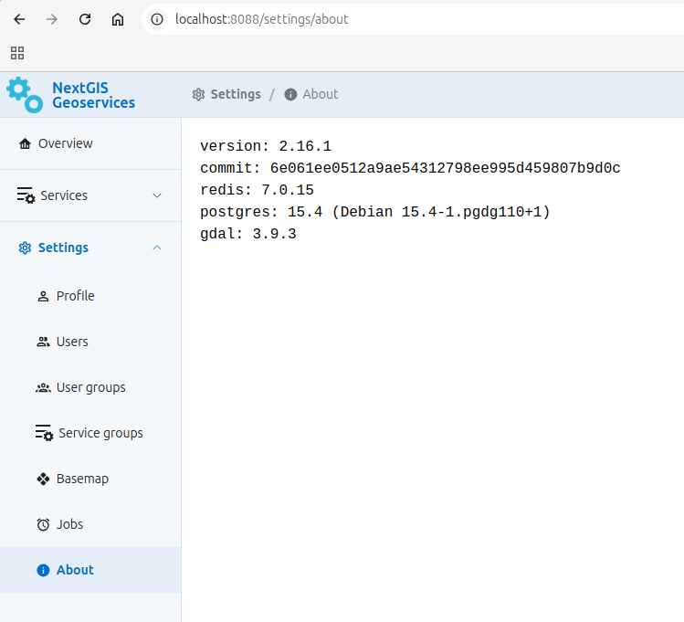

.. _docs_geoserv_prem_admin:

Administrator manual for NextGIS GeoServices
=====================================================

Introduction
-------------

This manual describes the process of deploying NextGIS GeoServices software on-premise. Mainly it uses Docker platform and docker-compose tool. All steps are performed on Linux-based OS.

.. _nggs_prem_admin_address:

Select endpoints
------------------------------

NextGIS GeoServices uses one HTTP (or HTTPS) endpoint. Users interact with the software via Web interface and API. The default value is http://server.example.com:8088 where server.example.com is the DNS name of the server where the software is deployed. If strictly necessary, the server IP address can be used instead of server.example.com.

If your IT infrastructure allows for it, it is recommended to set up a reverse proxy for TLS encryption and using HTTPS. It is especially important if the software is to be accessed not just from the local network, but also from the Internet. In that case the endpoints depend on the settings of the reverse proxy.

Contact your IT department to choose endpoints you wish to use and note them down, you'll need them later. The reverse proxy is set up by the client's IT department, it is not a responsibility of NextGIS company. The required parameters are cited `below using Nginx as example <https://docs.nextgis.com/docs_geoserv_prem/source/admin.html#nggs-prem-admin-proxy>`_.

.. _nggs_prem_admin_docker:

Install and configure Docker
----------------------------

If the server does not yet have Docker Engine and Docker Compose installed, first you need to install them or update them to the latest versions:

* `Docker Engine <https://docs.docker.com/engine/install/>`_
* `Docker Compose <https://docs.docker.com/compose/install/linux/>`_

To get the images log in to NextGIS Container Registry with the username (example) and password (sesame) provided by NextGIS::

   $ docker login cr.nextgis.com -u example -p sesame
   Login Succeeded

If the software is deployed to a server without Internet access, contact support for a single-file image archive instead. You'll need to transfer it to the server and load the images using 'docker load' command.

.. _nggs_prem_admin_installgs:

Install NextGIS GeoServices
---------------------------

On the server where you plan to deploy GeoServices, create the ``/srv/geoservices`` directory, then go to it, download the configuration template (`docker-compose-2.19.0.tar.bz2 <https://nextgis.com/onpremise/geoservices/docker-compose-2.19.0.tar.bz2>`_, where 2.19.0 is the current version) and unpack it. If the server does not have Internet access, download the file on another PC and transfer it to the server.

.. code-block::

	$ mkdir /srv/geoservices
	$ cd /srv/geoservices
	$ wget https://nextgis.com/onpremise/geoservices/docker-compose-2.19.0.tar.bz2
	$ tar jxf docker-compose-2.19.0.tar.bz2
	Edit the .env file in a text editor and enter the values for these environmental variables: POSTGRES_PASSWORD, DB_PASSWORD, BM_DB_PASSWORD (must have the same values), ADMIN_PASSWORD and SESSION_KEY. In the end you should get something like this:
	IMAGE_VERSION=2.19.0
	IMAGE_BASE=cr.nextgis.com/geoservices
	COMPOSE_BIND=0.0.0.0
	
	DEBUG=false
	S3_SSL=false
	EXT_SOURCES_SUPPORT=false
	POSTGRES_USER=geoservices
	SESSION_KEY=secret1
	POSTGRES_PASSWORD=secret2
	DB_PASSWORD=secret2
	BM_DB_PASSWORD=secret2
	ADMIN_PASSWORD=secret3

To connect NextGIS Geoservices to your NextGIS Web instance also add these environmental variables: 

* NGW_URL - your company WEB GIS url, i.e. https://demo.nextgis.com.
* NGW_LOGIN - user name with sufficient permissions, if empty - guest connection will be used.
* NGW_APIKEY - user password.

Add these variables to docker-compose using template above.

After this launch the Docker Compose stack. We recommend launching postgres service first, then after about 30 seconds launch the rest:

.. code-block::

	$ docker compose up -d postgres && sleep 30      
	[+] Running 3/3
	 ✔ Network geoservices_default       Created         0.0s 
	 ✔ Volume "geoservices_postgres"     Created         0.1s 
	 ✔ Container geoservices-postgres-1  Started         4.2s
	
	$ docker compose up -d
	[+] Running 8/8
	 ✔ Volume "geoservices_s3"                Created         0.0s 
	 ✔ Volume "geoservices_secret"            Created         0.1s 
	 ✔ Volume "geoservices_data"              Created         0.0s 
	 ✔ Volume "geoservices_redis"             Created         0.1s 
	 ✔ Container geoservices-postgres-1       Running         0.0s 
	 ✔ Container geoservices-redis-1          Started         7.3s 
	 ✔ Container geoservices-s3-1             Started         7.5s 
	 ✔ Container geoservices-node-renderer-1  Started         0.2s 
	 ✔ Container geoservices-app-1            Started         5.9s

This completes the installation. If you use HTTPS, next `configure the reverse proxy server <https://docs.nextgis.com/docs_geoserv_prem/source/admin.html#nggs-prem-admin-proxy>`_. Otherwise proceed to `operability check <https://docs.nextgis.com/docs_geoserv_prem/source/admin.html#nggs-prem-admin-check>`_.

.. _nggs_prem_admin_proxy:

Recommendations for reverse proxy setup
---------------------------------------------------

To use HTTPS encryption we recommend setting up a reverse proxy server based on Nginx. For reference here's a fragment of the configuration file for geoservices.example.com:

.. code-block::

	server {
	    server_name geoservices.example.com;
	    # Server directives: listen, ssl_* etc
	
	    location / {
	        client_max_body_size 2G;
	
	        proxy_http_version 1.1;
	        proxy_pass http://127.0.0.1:8088;
	        proxy_set_header Host $http_host;
	        proxy_set_header Upgrade $http_upgrade;
	        proxy_set_header Connection $proxy_connection;
	        proxy_set_header X-Forwarded-Proto $scheme;
	        proxy_set_header X-Forwarded-For $remote_addr;
	    }
	}

The client_max_body_size directive defines the max size of the upload file (2 GiB in our example).

.. _nggs_prem_admin_check:

Operability check
-----------------------------

In a Web browser open the Web interface of NextGIS GeoServices using the URL you've chosen.

A sign-in form should appear. Enter the username 'admin' and the password that you set in the ADMIN_PASSWORD variable.

Go to the About page, it must look like this:

   About page

.. _nggs_prem_admin_cache:

Clear cache
------------

After a service is deleted, its cache remains. To remove the cache delete the following folders:

.. code-block::

   /data/geoservices/ras/$ID/
   /data/geoservices/vec/$ID/

``$ID`` is the ID of the deleted service. The ``vec`` folder is formed only for basemap services that generate vector tiles.
