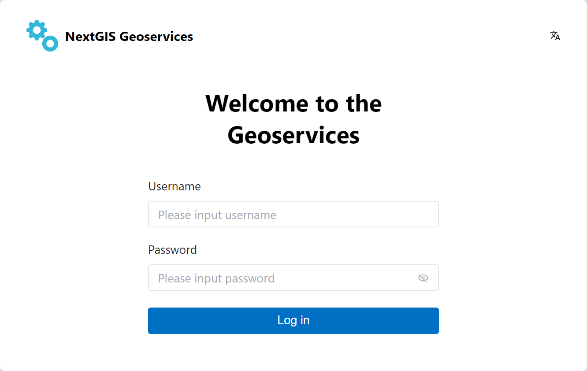
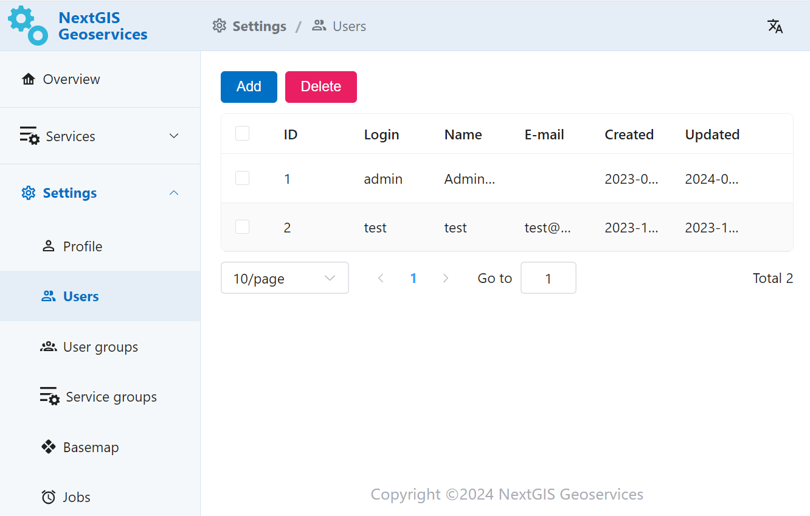

.. _docs_geoserv_prem_auth:

Authorization
=============

To start working with the app user needs to log in.
Enter username and password in the corresponding fields.
Admin credentials for initial log-in are generated when the app is deployed.

   Authorization in NextGIS GeoServices on-premise

Administrator can create local users within GeoServices (in Settings).

   "Users" section in GeoServices Settings
