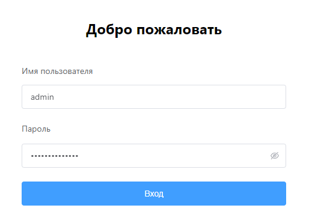
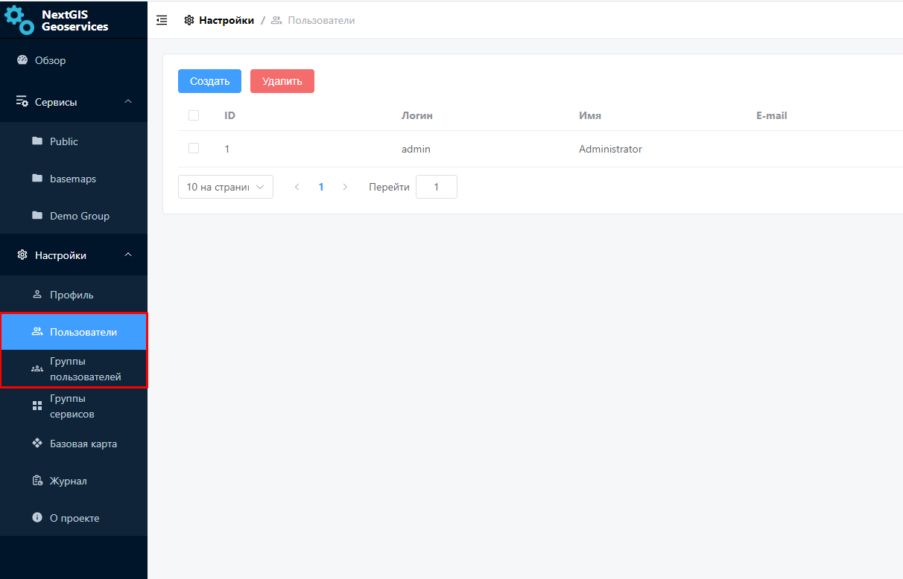

.. _docs_geoserv_prem_auth:

Авторизация
============

Для начала работы пользователю требуется авторизоваться.
В соответствующих полях нужно указать имя пользователя и его пароль.
Учетные данные для первого входа администратора предоставляются при развертывании приложения.

   Авторизация в NextGIS GeoServices on-premise

Администратор имеет возможность добавлять локальных пользователей внутри самих Геосервисов в разделе Настройки.

   Раздел "Пользователи" в настройках геосервисов
