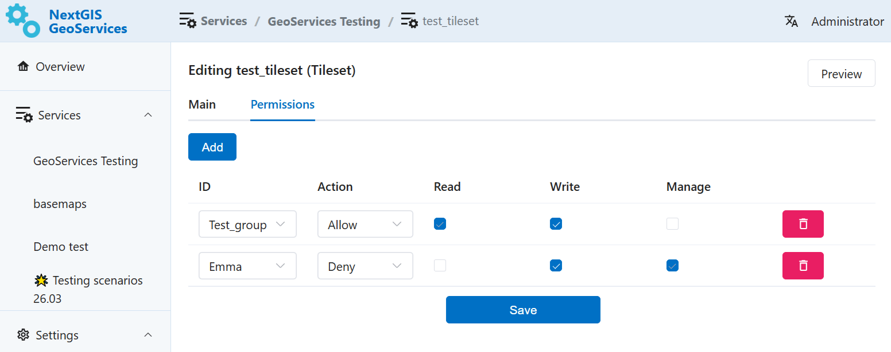

Access permissions
==================

If several users need to have access to NextGIS GeoServices, you can set up different access rights for them.

By default, Administrators have all the permissions, other users have no permissions.

Permissions can be set for a group of services or a particular service.

Go to the settings of a service group or a service and open the Permissions tab.

Click **Add** to create a new rule.

   Two rules added: one allows, one restricts access

1. Select from the dropdown list a user or a user group to which the rule applies. (`How to add user to a group <https://docs.nextgis.com/docs_geoserv_prem/source/settings.html#geoserv-prem-set-users>`_)

2. Select the action: **Allow** or **Deny**.

3. Tick the permissions: read, write, manage. The permission are cascading. 

* If you allow a user to "Write", it automatically gives the "Read" permission too. Permission "Manage" gives both other permissions automatically.
* Restrictions work in the opposite order. If you deny a user the permission to read it automatically forbids other actions too.

4. After you've set up the neccessary permission rules, click **Save**.

To delete a rule, click on the red trash can icon to the right of it.

.. _perm_levels:

How different permission rules work together
---------------------------------------------

You can add several permission rules for a service or a group of services. But only one rule per user/user group. 

You can combine permissions of different levels:

* For the service group (for example, allow a group of users to read it), 
* For individual services inside the group (for example, give one user permission to manage one of the services and deny a different user to read a particular service).

.. important:: User included in the Administrator group has all permissions for all the services, even if you set up rules that contradict it.
