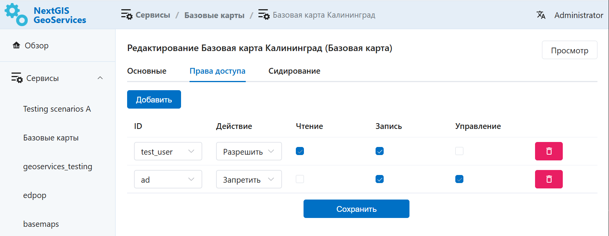

Права доступа
=============

Если у вас несколько пользователей, которые должны иметь доступ к NextGIS GeoServices, можно настроить для них права доступа.

По умолчанию администраторы имеет все права, а пользователи, не включённые в группу "Администраторы", не имеют никаких прав.

Права доступа настраиваются на уровне группы сервисов или отдельного сервиса.

Перейдите в настройки группы или сервиса, откройте вкладку "Права доступа".

Нажмите **Добавить**, чтобы создать новое правило.

   Добавлено два правила для сервиса: одно разрешающее, другое - запрещающее

1. Выберите из списка, для какого пользователя или группы пользователей будет действовать это правило. (`Как добавить пользователя в группу <https://docs.nextgis.ru/docs_geoserv_prem/source/settings.html#geoserv-prem-set-users>`_)

2. Выберите действие: **Разрешить** или **Запретить**.

3. Отметьте соответствующие права: чтение, запись, управление. Права действуют иерархически. 

* Разрешение на "Запись" автоматически даёт также право на чтение. Право "Управление" даёт автоматически два остальных права.
* При запрещении иерархия действует в обратную сторону: если запретить чтение - это запретит все действия.

4. Настроив нужные права, нажмите **Сохранить**.

Чтобы удалить правило, нажмите на красную иконку мусорной корзины в правом конце строки.

.. _perm_levels:

Сочетание прав доступа
-------------------------

Для одного сервиса или группы сервисов можно добавить несколько правил. В отношении конкретного пользователя или группы пользователей может быть добавлено только одно правило. 

Можно сочетать правила доступа на разном уровне:

* Для группы сервисов (например, открыть её на чтение для группы пользователей), 
* Для отдельных входящих в неё сервисов (например, одному пользователю дать право управления конкретным сервисом, а другому - запретить чтение одного из сервисов).

.. important:: Пользователь, включённый в группу "Администраторы" будет иметь все права на все сервисы независимо от того, какие отдельные права для него выставлены.
