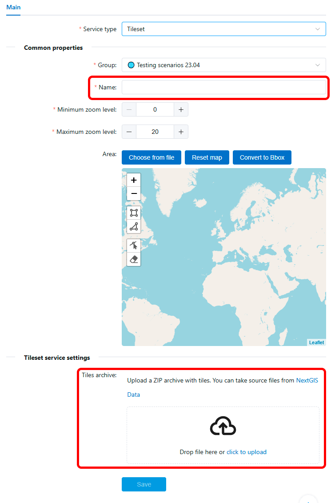
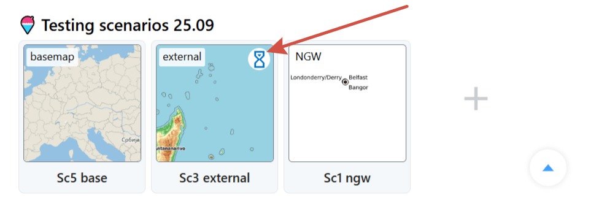
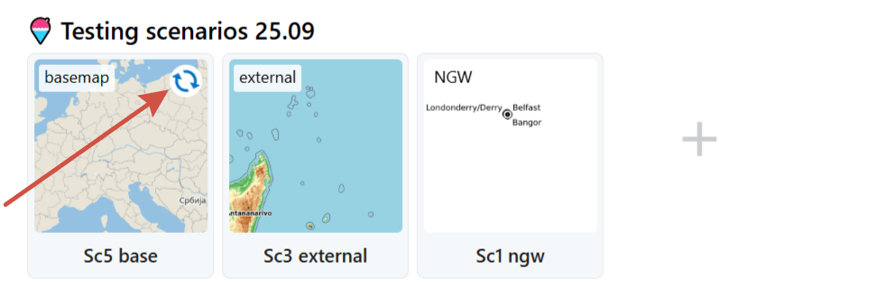

.. _docs_geoserv_prem_services:

Services
========

Service groups
---------------

Services can be added only to specific groups of services. Groups are created in Settings in **Service groups** tab.

.. figure:: _static/geosop_gr_serv1_en.png
   :name: geosop_gr_serv1
   :align: center
   :width: 20cm

   One of the service groups 

You can delete or edit a group using buttons.

.. figure:: _static/geosop_gr_serv2_en.png
   :name: geosop_gr_serv2
   :align: center
   :width: 20cm

   Service groups settings

To create a new group, press **Add** and enter a name for it.

.. figure:: _static/geosop_gr_serv3_en.png
   :name: geosop_gr_serv3
   :align: center
   :width: 16cm

   Adding new service group

You can move the services between groups, the only exception is the Public group, its contents cannot be modified.

.. _gs_new_service:

Add service
-----------

To create a new service, open the group you wish to add it to and press **Create service**.

Three types of services are available:

* `Basemap <https://docs.nextgis.com/docs_geoserv_prem/source/services.html#basemap-service>`_ - based on OpenStreetMap data uploaded as PBF in the `Basemap settings <https://docs.nextgis.com/docs_geoserv_prem/source/settings.html#basemap>`_;
* `NGW <https://docs.nextgis.com/docs_geoserv_prem/source/services.html#ngw-web-maps>`_- it uses a Web Map created on the NextGIS Web platform as a source;
* `External <https://docs.nextgis.com/docs_geoserv_prem/source/services.html#external-tms>`_ - TMS from a third-party source.

The tiles for a newly created service are generated when first queried, so the first user of the service may experience a delay in displaying the map. To avoid it, you can `generate the tiles beforehand <https://docs.nextgis.com/docs_geoserv_prem/source/services.html#seeding>`_.

When you delete a service, its cache remains on the server. It can be `deleted by the administrator <https://docs.nextgis.com/docs_geoserv_prem/source/admin.html#clear-cache>`_.

Basemap
----------------

This type of service is based on OpenStreetMap data in PBF format. It can be uploaded in the `basemap settings <https://docs.nextgis.com/docs_geoserv_prem/source/settings.html#basemap>`_.

You can use one dataset to create multiple services with varying extent, style, zoom levels etc.

Press **Create service** in the service group. Select "basemap" as type.

.. figure:: _static/geosop_ngw1_en.png
   :name: geosop_base_new_pic
   :align: center
   :width: 20cm

   Button for creating new service

Configure the following parameters:

* Name
* Minimum zoom level
* Maximum zoom level
* Area
* Select OpenStreetMap layers to be included in this service
* Pick a style or upload a custom one as JSON file

Press **Save**.

Basemap services can be added to QGIS both as raster tiles and vector tiles. Vector tiles can be handy if you want more control over the labels.

To add vector tiles to QGIS create a new connection and enter the style URL and the Vector XYZ URL of the service (see :numref:`geosop_vector_tiles`).

.. figure:: _static/geosop_base_XYZ_en.png
   :name: geosop_vector_tiles
   :align: center
   :width: 20cm

   Links of the default basemap service

NextGIS Web 
------------

`NextGIS Web <https://nextgis.com/nextgis-web/>`_ is a server-based geoinformation system for gathering, storing, visualising and analyzing geospacial data.

NGW Web Maps service allows to created cached tile services based on Web Maps created in NextGIS Web.

Administrator enters URL of a Web Map in NextGIS Web, service name and scale limits for caching.
After that the service will appear in the list. Service can be modified or deleted.

Working with the service does not engage NextGIS Web itself, so the service can handle high peak loads and reduce the load on NextGIS Web.

.. figure:: _static/geosop_ngw1_en.png
   :name: geosop_ngw1
   :align: center
   :width: 20cm

   Button for creating new service

.. figure:: _static/geosop_ngw2_en.png
   :name: geosop_ngw2
   :align: center
   :width: 20cm

   Parameters for the new service

.. figure:: _static/geosop_ngw3_en.png
   :name: geosop_ngw3
   :align: center
   :width: 20cm

   Newly created sevice in the group

External TMS
------------

GeoServices allows to add, cache and use external TMS.

.. important:: Before using an external service, check its terms of use. Violating terms of use may result in blocking from the service side.

Open the service group and click **Create service**.

.. figure:: _static/geosop_tms1_en.png
   :name: geosop_tms1
   :align: center
   :width: 20cm

   Button for creating new service

Enter the parameters:

* name;
* zoom levels;
* URL of the TMS service;
* select coordinate system.

.. figure:: _static/geosop_tms2_en.png
   :name: geosop_tms2
   :align: center
   :width: 20cm

   Parameters for the new TMS service

The newly created service will appear in the selected group. Service can be modified or deleted.

.. figure:: _static/geosop_tms3_en.png
   :name: geosop_tms3
   :align: center
   :width: 20cm

   Newly created TMS sevice in the group

.. _gs_prem_tiles:

Tileset
---------

You can upload a ZIP-file containing pre-made tiles to create a service. For example, basemap tiles `ordered on NextGIS Data <https://data.nextgis.com/en/region/custom/tiles/?from-docs=1>`_.

.. figure:: _static/geosop_tms1_en.png
   :name: geosop_tiles_new_pic
   :align: center
   :width: 20cm

   Button for creating new service

All you need to do is enter a name for the service and upload a ZIP-file. Other parameters will be set automatically.

   Parameters of a Tileset serivce

Click **Save** to complete.

The newly created service will appear in the selected group. Services can be modified or deleted.

.. _gs_prem_seed:

Seeding
-----------

To help services work faster you can cache tiles of the area.

Press the pencil icon to enter the edit mode of the tile service.

Go to the "Seeding" tab and press **Create new task**.

.. figure:: _static/geosop_seeding_create_task_en.png
   :name: geosop_seeding_create_task_pic
   :align: center
   :width: 20cm

   "Seeding" tab

In the opened dialog configure seeding parameters.

* Cache type - Default raster (recommended) or Vector tiles;
* Task type - defines how the cache is rendered:

   * the default option is *Render only missing tiles*, the system checks already loaded tiles and loads the absent ones;
   * *Full render* - all tiles for the area will be re-loaded, it's a faster process;
   * *Delete cache* - select it if you need to clear cache and remove all previously rendered tiles;

* Zoom list - higher zoom levels need more time to process, so we recommend staying within level 12 unless necessary;

.. note:: Keep in mind that the API key also can have zoom limits. In this case there's no point to set zoom levels beyond that limit for seeding.

* Area - upload boundary as a file or draw it on the map.

.. figure:: _static/geosop_seeding_task_settings_en.png
   :name: geosop_seeding_task_settings_pic
   :align: center
   :width: 14cm

   Seeding task settings

After configuring seeding parameters press **Create**.

The task will appear on the tab. Here you can check its status: pending, in progress, finished, failed with error.

.. figure:: _static/geosop_seeding_task_status_en.png
   :name: geosop_seeding_task_status_pic
   :align: center
   :width: 20cm

   Status of the seeding task

.. important:: Seeding tasks are processed sequentially, so the new task will start only after all the previous tasks are completed.

On the Overview page the services that are waiting for their turn for seeding are marked by an hourglass:

   Seeding status: pending

Service currently in process of seeding is marked by circular arrows:

   Seeding status: in progress