.. _docs_geoserv_prem_services:

Services
========

Service groups
---------------

Services can be added only to specific groups of services. Groups are created in Settings in **Service groups** tab.

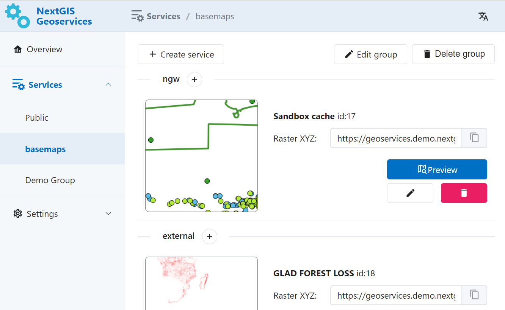

   One of the service groups 

You can delete or edit a group using buttons.

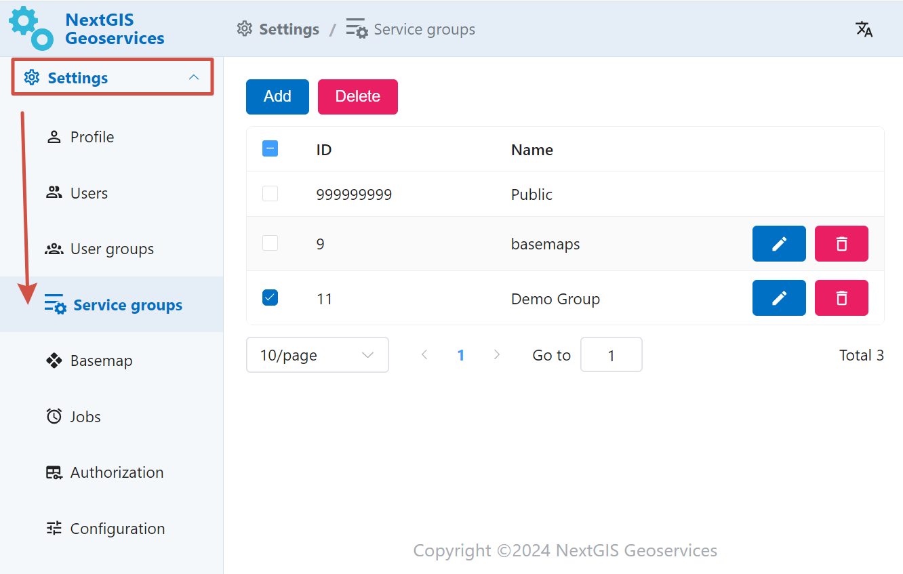

   Service groups settings

To create a new group, press **Add** and enter a name for it.

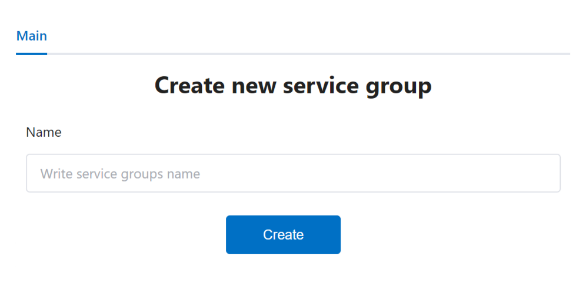

   Adding new service group

NGW Web Maps
------------

`NextGIS Web <https://nextgis.com/nextgis-web/>`_ is a server-based geoinformation system for gathering, storing, visualising and analyzing geospacial data.

NGW Web Maps service allows to created cached tile services based on Web Maps created in NextGIS Web.

Administrator enters URL of a Web Map in NextGIS Web, service name and scale limits for caching.
After that the service will appear in the list. Service can be modified or deleted.

Working with the service does not engage NextGIS Web itself, so the service can handle high peak loads and reduce the load on NextGIS Web.

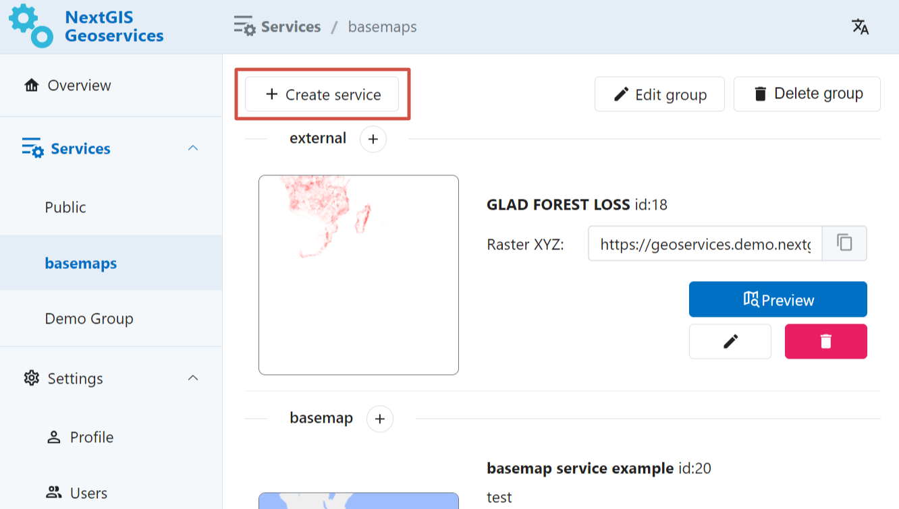

   Button for creating new service

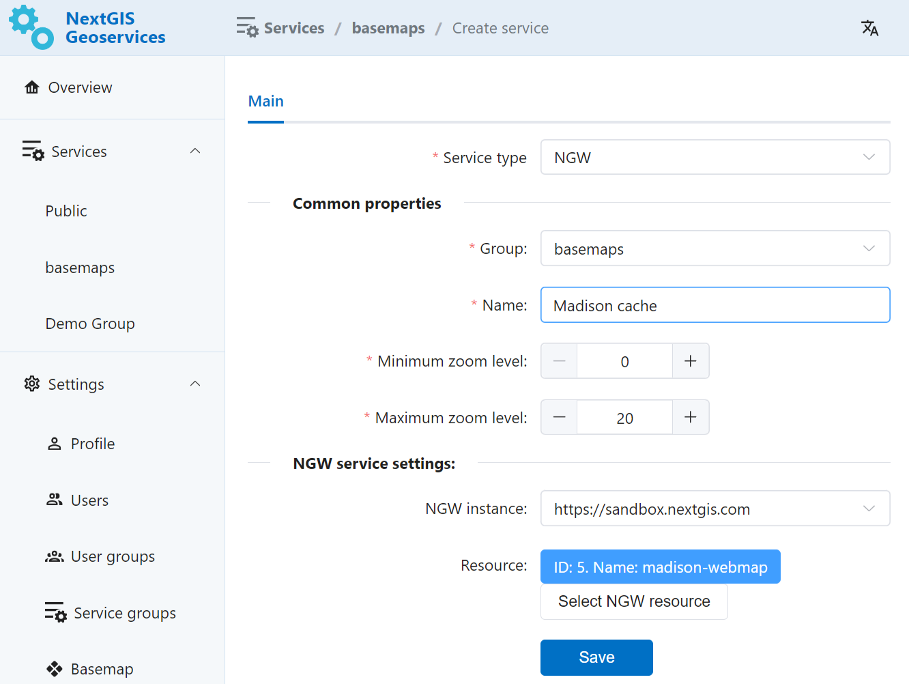

   Parameters for the new service

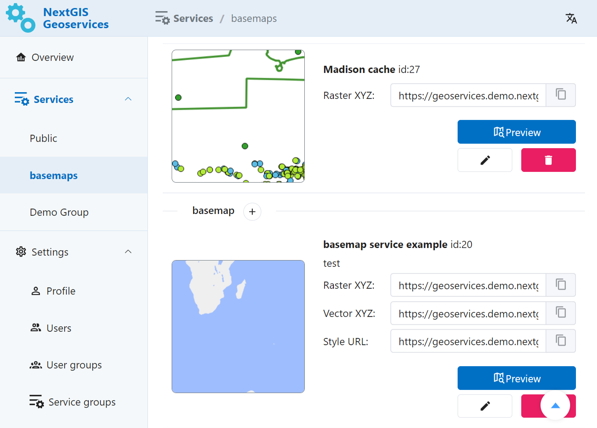

   Newly created sevice in the group

External TMS
------------

GeoServices allows to add, cache and use external TMS.

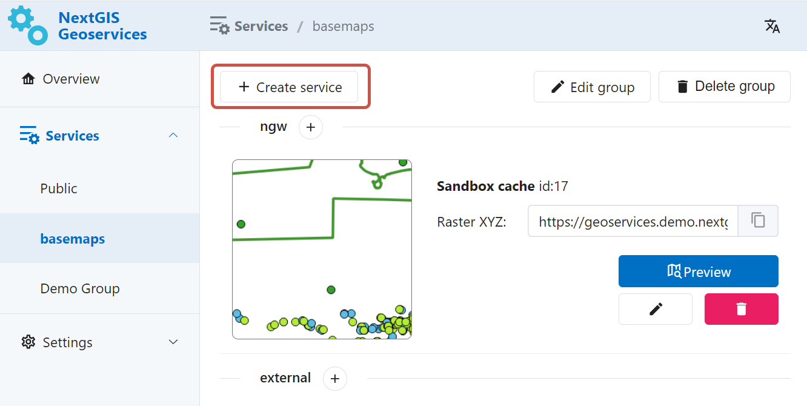

   Button for creating new service

Enter name for the service, URL of the TMS service, select coordinate system and scale limits.
The newly created service will appear in the selected group. Service can be modified or deleted.

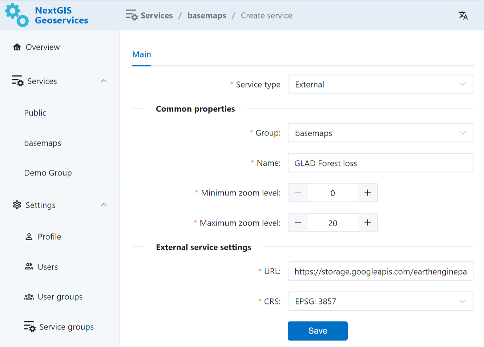

   Parameters for the new TMS service

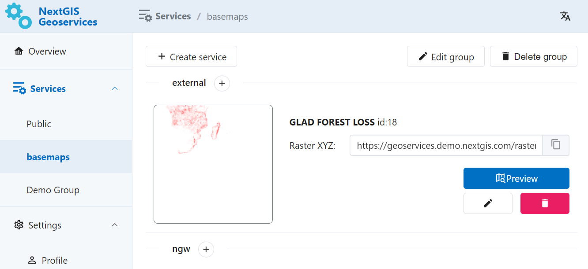

   Newly created TMS sevice in the group

.. _gs_prem_seed:

Seeding
-----------

To help services work faster you can cache tiles of the area.

Press the pencil icon to enter the edit mode of the tile service.

Go to the "Seeding" tab and press **Create new task**.

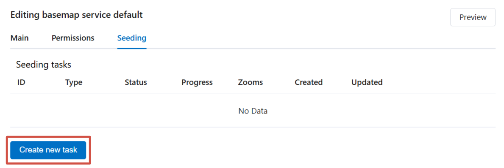

   "Seeding" tab

In the opened dialog configure seeding parameters.

* Cache type - Default raster (recommended) or Vector tiles;
* Task type - defines how the cache is rendered:

   * the default option is *Render only missing tiles*, the system checks already loaded tiles and loads the absent ones;
   * *Full render* - all tiles for the area will be re-loaded, it's a faster process;
   * *Delete cache* - select it if you need to clear cache and remove all previously rendered tiles;

* Zoom list - higher zoom levels need more time to process, so we recommend staying within level 12 unless necessary;

.. note:: Keep in mind that the API key also can have zoom limits. In this case there's no point to set zoom levels beyond that limit for seeding.

* Area - upload boundary as a file or draw it on the map.

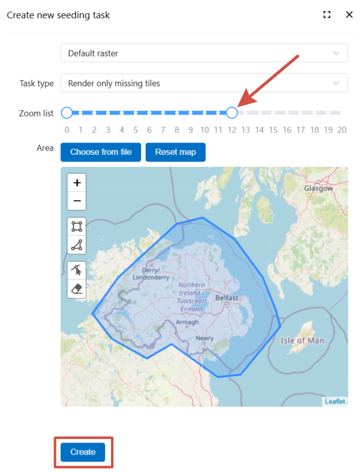

   Seeding task settings

After configuring seeding parameters press **Create**.

The task will appear on the tab. Here you can check its status: pending, in progress, finished, failed with error.

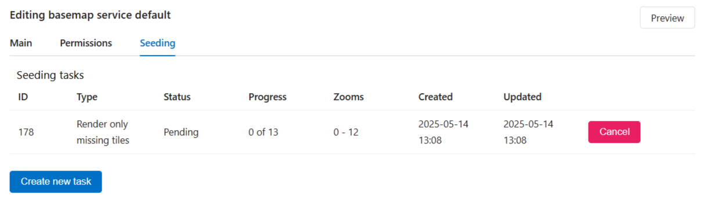

   Status of the seeding task

.. important:: Seeding tasks are processed sequentially, so the new task will start only after all the previous tasks are completed.
