.. _docs_geoserv_prem_services:

Сервисы
=======

.. _gs_prem_service_groups:

Группы сервисов
---------------

Сервисы в приложение могут быть добавлены только в определенные группы сервисов. Группы задаются в настройках на вкладке **Группы сервисов**.

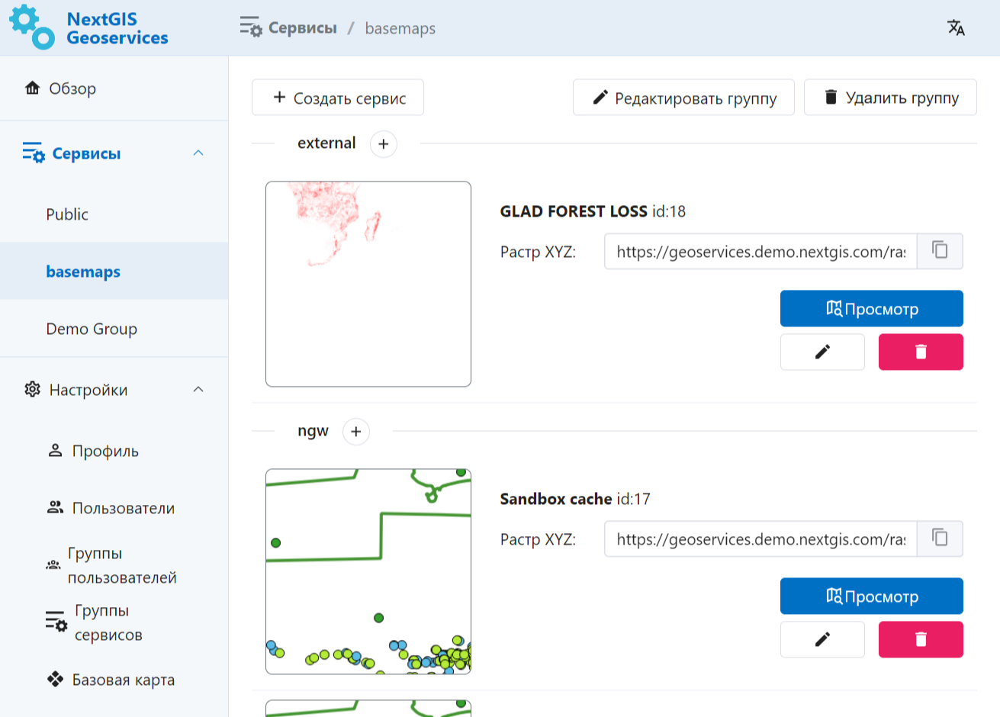

   Одна из групп сервисов

Удалить или изменить группу сервисов можно с помощью соответствующей кнопки в интерфейсе, выбрав нужные сервисы.

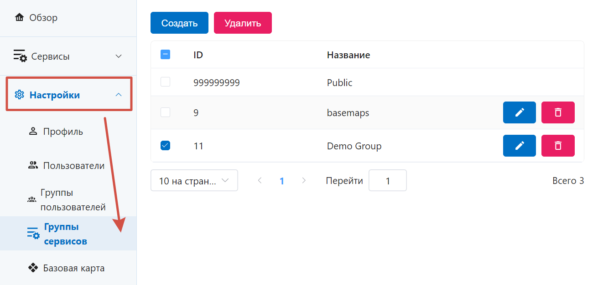

   Настройки групп сервисов

Для создания новой группы следует указать её название.

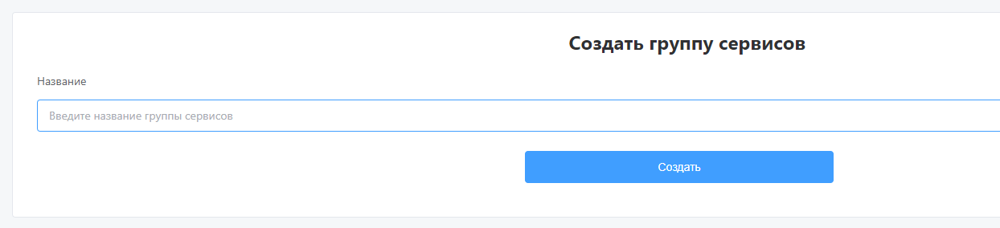

   Создание новой группы сервисов

Созданные сервисы можно переносить между группами в настройках сервиса. Исключение составляет техническая группа Public, её состав изменить нельзя.

Добавление сервиса
--------------------

Для того, чтобы создать сервис, зайдите в созданную вами группу и нажмите **Создать сервис**. 

Можно создавать сервисы трёх типов:

* `NGW <https://docs.nextgis.ru/docs_geoserv_prem/source/services.html#ngw>`_ - на основе веб-карты, созданной на платформе NextGIS;
* `Внешний <https://docs.nextgis.ru/docs_geoserv_prem/source/services.html#tms>`_ - TMS-сервис из внешнего источника;
* `Базовая карта <https://docs.nextgis.ru/docs_geoserv_prem/source/services.html#gs-prem-basemap>`_ - на основе данных OpenStreetMaps, загруженных на портал GeoServices в формате PBF.

При первом добавлении сервиса на веб-карту или в настольное приложение начинают запрашиваться тайлы, таким образом на сервере формируется кэш. Если данных много, первичное формирование кэша может быть медленным. Можно заранее создать кэш на нужную область, запустив `сидирование <https://docs.nextgis.ru/docs_geoserv_prem/source/services.html#gs-prem-seed>`_.

После удаления сервиса его кэш остаётся. Администратор может `удалить кэш вручную <https://docs.nextgis.ru/docs_geoserv_prem/source/admin.html#nggs-prem-admin-cache>`_.

.. _gs_prem_ngw_webmaps:

Сервис из веб-карты NGW
------------------------

`NextGIS Web <https://nextgis.ru/nextgis-web/>`_ - это серверная геоинформационная система, предназначенная для сбора, хранения, визуализации и обработки пространственных данных.

Сервис NGW Web Maps позволяет создавать кэшированные тайловые сервисы на основе веб-карт, созданных в NextGIS Web. 

Обращение к созданному сервису не затрагивает NextGIS Web, таким образом можно создать сервис для высоких пиковых нагрузок и снизить нагрузку на сам NextGIS Web.

Также Веб-карты, на которые добавлено много слоёв с большим количеством объектов, могут долго загружаться и требовать больших ресурсов для постоянной перерисовки слоёв при изменеии зума или охвата. Можно создать на её основе сервис и подключить тайлы в качестве подложки на другую карту, они будут загружаться значительно быстрее.

Чтобы создать сервис на основе веб-карты администратор указывает: URL развернутого NextGIS Web, ресурс веб-карты, название сервиса и диапазон масштабных уровней для кэширования.

После этого сервис появится в списке созданных. При необходимости сервис можно отредактировать или удалить.

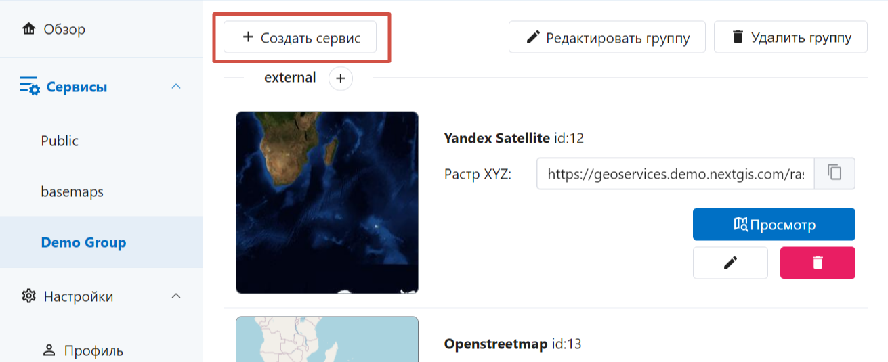

   Кнопка добавления нового сервиса

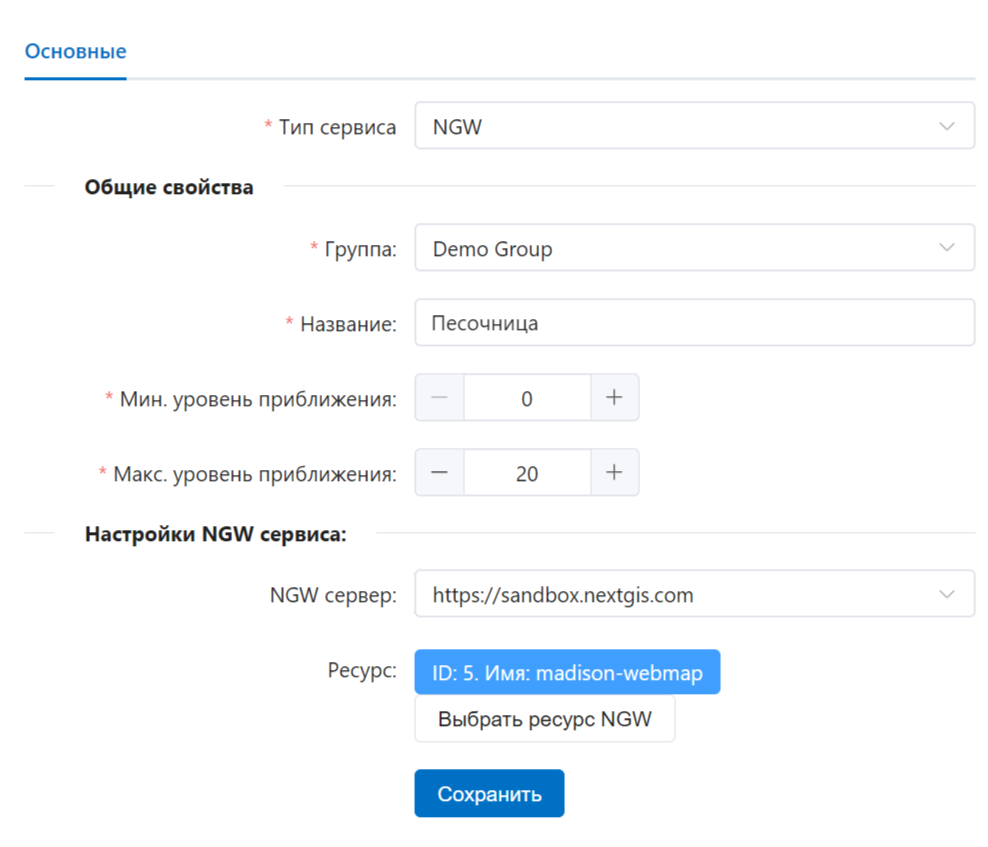

   Параметры создаваемого сервиса

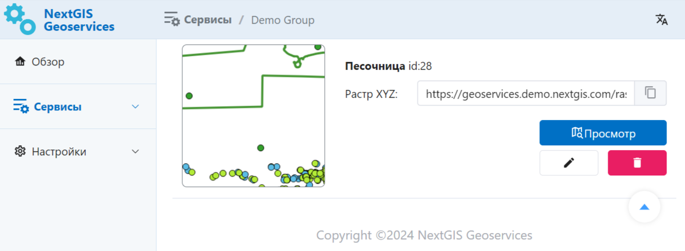

   Созданный сервис в группе

.. _gs_prem_tms:

Внешний TMS
------------

Геосервисы позволяют добавлять внешние TMS для их дальнейшего кэширования и использования.

В форме заполняются название, диапазон уровней отображения, границы сервиса, URL добавляемого TMS сервиса, система координат.
После чего сервис появится в списке соответствующей группы. При необходимости сервис можно отредактировать или удалить.

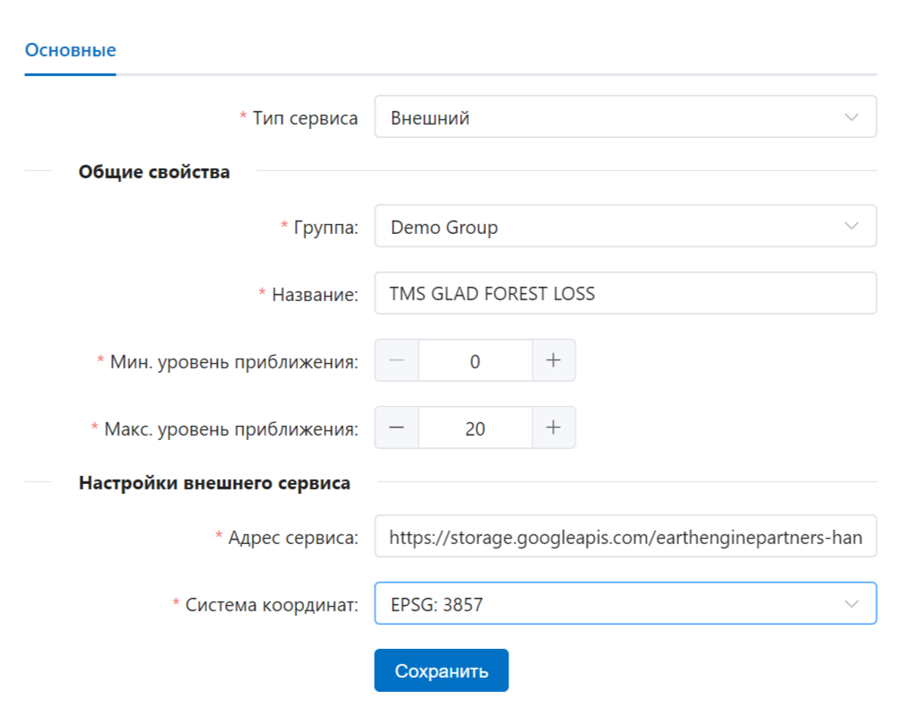

   Параметры создаваемого сервиса

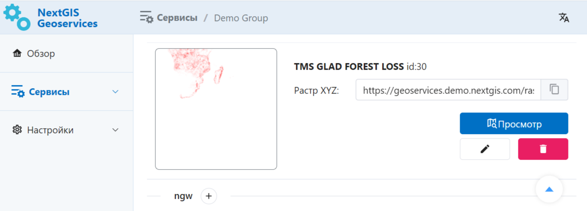

   Созданный сервис в группе

.. _gs_prem_basemap:

Сервис базовой карты
------------------------

В качестве основы для создания сервиса можно использовать также данные OpenStreetMaps в формате PBF. Эти данные загружаются в `настройках базовой карты <https://docs.nextgis.ru/docs_geoserv_prem/source/settings.html#geoserv-prem-set-basemap>`_.

На их основе можно создавать сервисы разного охвата и с разными стилями.

Выберите тип сервиса "Базовая карта".

Задайте для него:

* Название
* Минимальный и максимальный уровень приближения
* Охват
* Выбрать слои OpenStreetMaps, которые будут включены в сервис
* Выбрать один из предлагаемых стилей или загрузить свой в формате GeoJSON

Затем нажмите **Сохранить**.

.. _gs_prem_seed:

Сидирование
-----------

Чтобы сервис работал быстрее, можно заранее закэшировать тайлы определённой области.

Зайдите в редактирование созданного тайлового сервиса, нажав на иконку с карандашом.

Перейдите во вкладку "Сидирование" и нажмите **Создать новую задачу**.

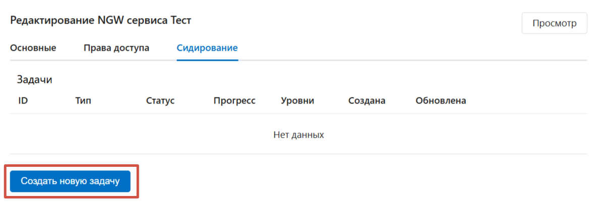

   Вкладка "Сидирование"

Откроется диалоговое окно, в котором нужно задать параметры сидирования.

* Тип кэша - обычный растр (рекомендуется) или векторные тайлы;
* Тип задачи - определяет, как нужно обработать кэш:

   * вариант по умолчанию: *заполнить отсутствующие тайлы*, в таком случае проверятся, какие тайлы уже были загружены, и догружаются остальные;
   * *полная перезапись* - все тайлы заданной области будут сохранены заново, это более быстрый способ;
   * *удалить кэш* - если необходимо очистить кэш, удалив ранее созданные тайлы;

* Уровни - каждый следующий уровень приближения требует больше времени на обработку, поэтому не рекомендуется ставить уровни выше 12 без необходимости;

.. note:: Обратите внимание, что ограничение по доступным уровням приближения может также содержаться в API-ключе, в таком случае включение более высоких зумов не имеет смысла.

* Охват - можно загрузить область из файла или нарисовать на карте.

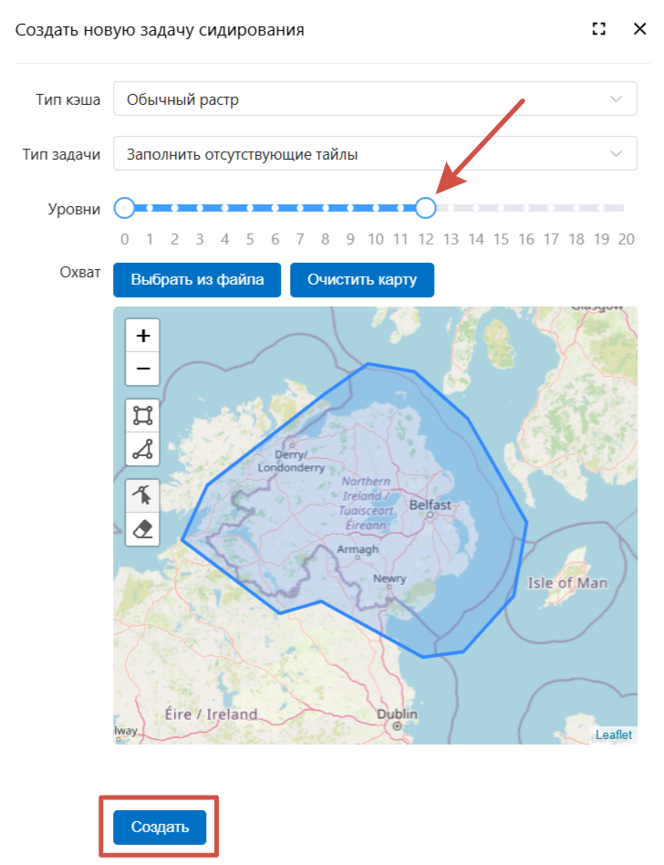

   Параметры задачи сидирования

Задав нужные параметры, нажмите **Создать**.

Задача появится на вкладке. Здесь можно отслеживать статус её выполнения: в очереди, в работе, завершена, завершена с ошибкой.

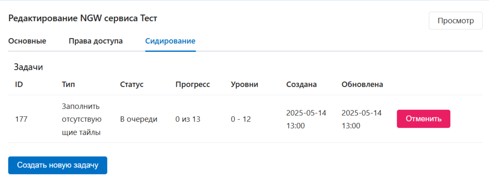

   Статус задачи сидирования

.. important:: Обратите внимание, что задачи сидирования выполняются последовательно. Поэтому новая задача не начнёт выполняться до тех пор, пока не завершатся все предыдущие. 

