.. _docs_geoserv_prem_settings:

Настройки
============

.. _geoserv_prem_set_profile:

Профиль
--------

Основная информация о пользователе содержится в разделе **Профиль**, которая делится на две вкладки: *Мой профиль* и *Мои API-ключи*.

В **Моем профиле** находятся:

* Логин
* Пароль (можно сразу изменить)
* Имя пользователя
* Электронная почта

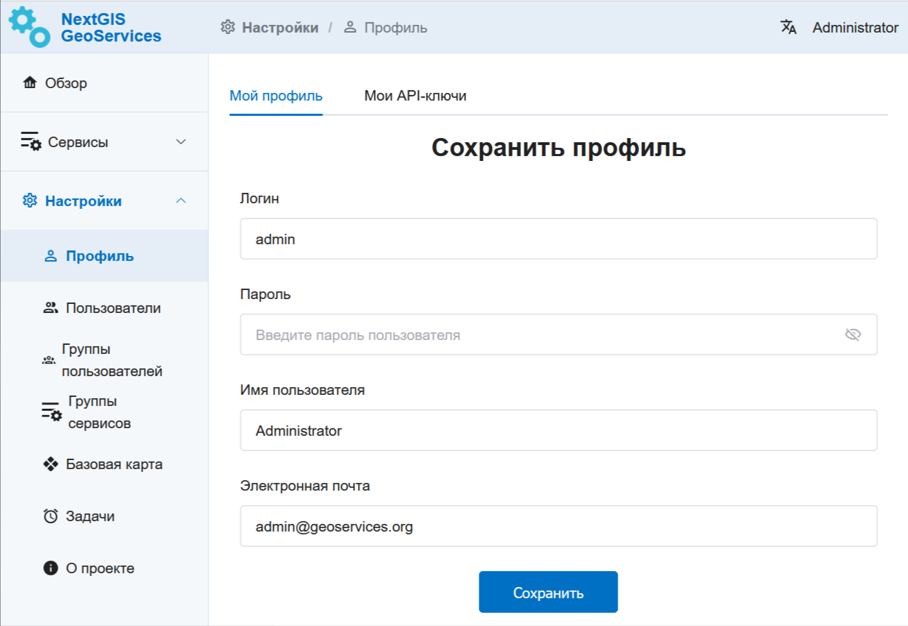

   Раздел "Мой профиль" в NextGIS GeoServices on-premise

**Мои API-ключи** служат для интеграции NextGIS GeoServices с другими сервисами NextGIS и внешними приложениями.
API ключ понадобится например для работы с сервисом НСПД в NextGIS Web, в настольном модуле NGQ Rosreestr Tools.
В данном разделе Администратор может создавать и удалять API-ключи.

Каждый API ключ может иметь свой срок действия, который определяется при его создании Администратором.
Здесь же задается охват, масштабные уровни и домены, на которые распространяется действие ключа.

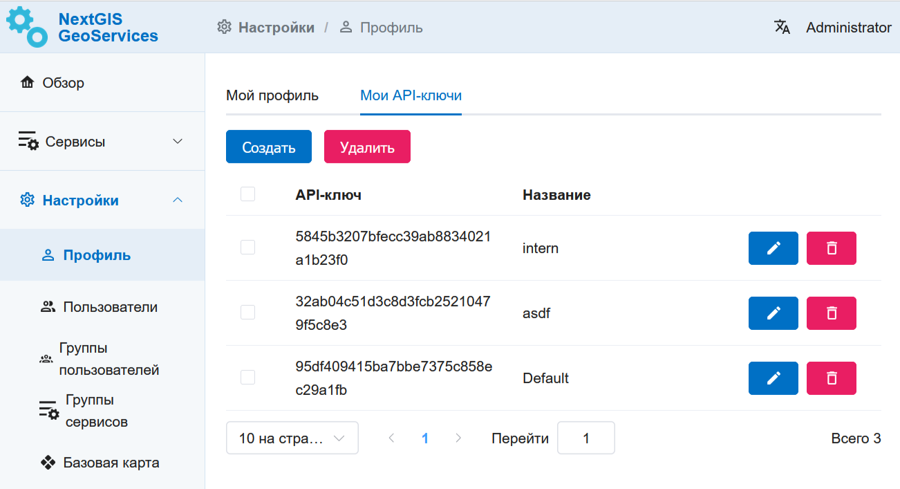

   Раздел "Мой API-ключи" в NextGIS GeoServices on-premise

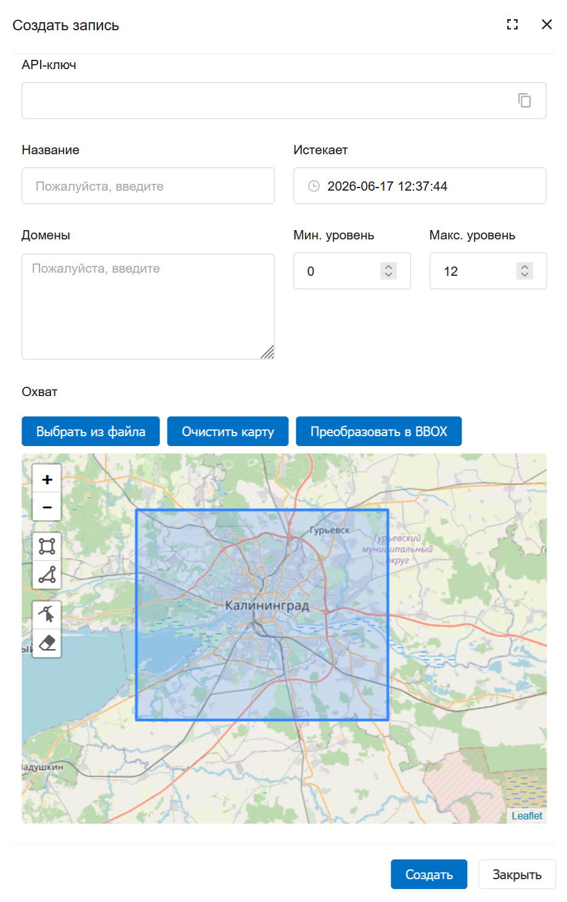

   Создание нового API-ключа

.. _geoserv_prem_set_basemap:

Базовая карта
--------------

В этом разделе загружаются данные OpenStreetMap, которые будут использоваться для создания сервисов базовой карты. На основе одного набора данных можно создавать сколько угодно сервисов разного охвата и масштабных уровней.

Данные для базовой карты загружаются в формате PBF (можно `заказать на NextGIS Data <https://data.nextgis.com/ru/region/custom/base/>`_).

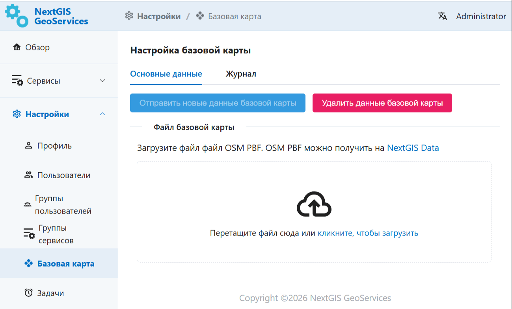

   Окно для загрузки файла базовой карты

Когда данные загружены, нажмите **Отправить новые данные базовой карты**. Это запустит процесс формирования тайлового сервиса на их основе.

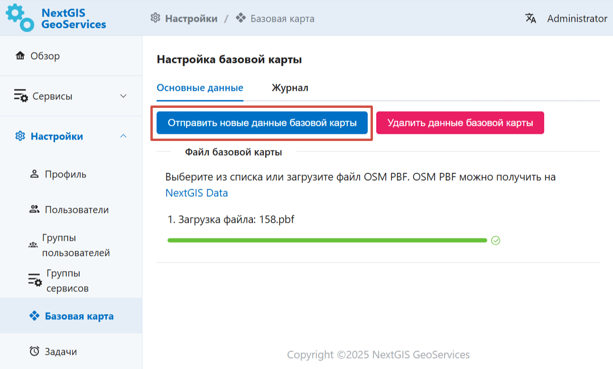

   Отправить новые данные для базовой карты

Процесс обработки данных можно отслеживать на вкладке "Журнал". После успешного завершения индикатор перейдет в зеленый статус.

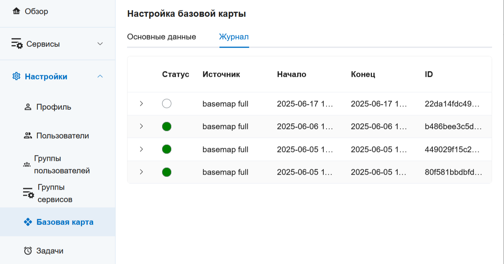

   Статус загрузки в журнале обработки файлов

Сервис базовой карты по умолчанию называется Default и располагается в разделе Сервисы в группе Public. Также можно `создавать сервисы <https://docs.nextgis.ru/docs_geoserv_prem/source/services.html#gs-prem-basemap>`_ с разными стилями и разным охватом на основе загруженных данных.

.. _geoserv_prem_set_log:

Журнал
-------

В журнале фиксируется история обработки данных и других действий на стороне приложения. 
Фиксируется статус, название процесса, его начало и конец, id задачи и выводятся информационные сообщения.

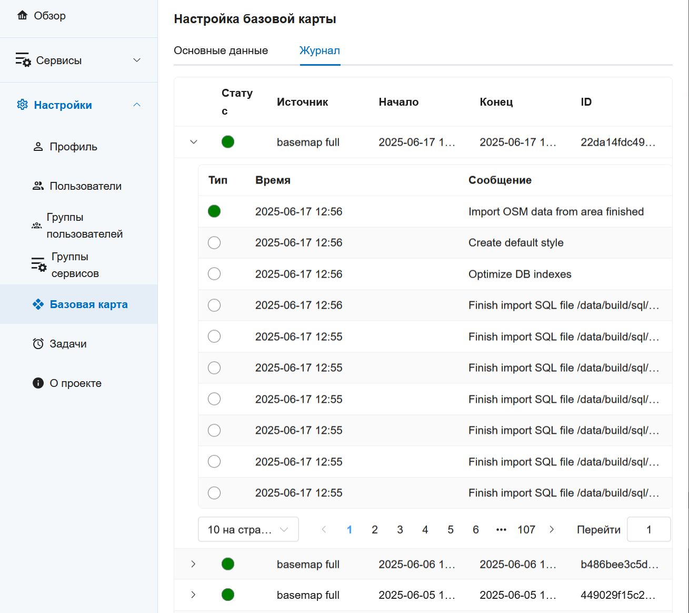

   Журнал регистрируемых действий в NextGIS GeoServices on-premise

.. _storage:

Хранилище
----------

В этом разделе отображается размер созданного сервисами кэша, хранящегося в S3.

Чтобы запустить оценку, нажмите **Оценка хранилища**. Рядом с этой кнопкой отображается дата последней оценки.

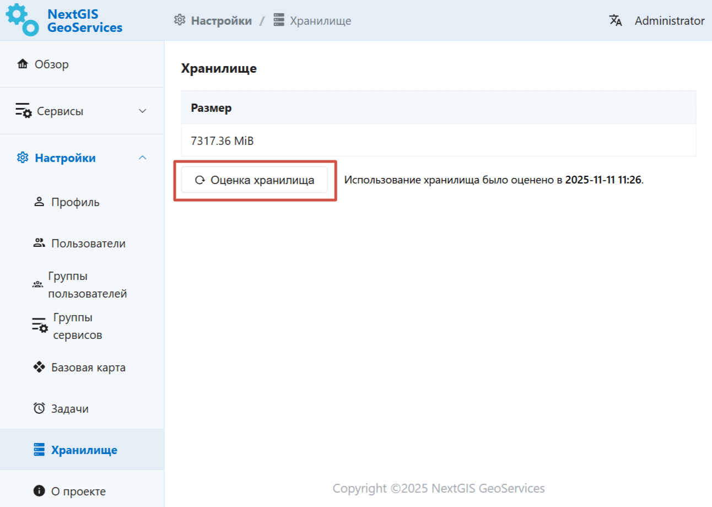

   Оценка общего размера кэша

Оценка занимаемого места производится не только для хранилища в целом, но и по отдельным сервисам. Эта информация отображается в режиме просмотра сервиса перед ссылкой на тайлы.

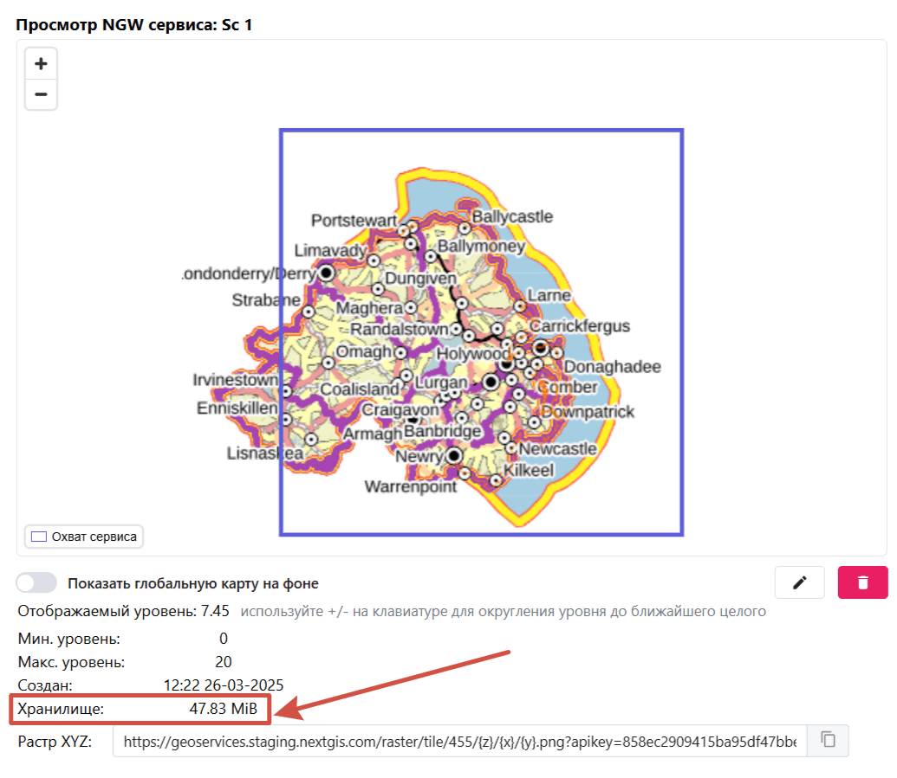

   Размер кэша отдельного сервиса

.. _geoserv_prem_set_about:

О проекте
-----------

Раздел, в котором прописаны текущие версии компонентов.

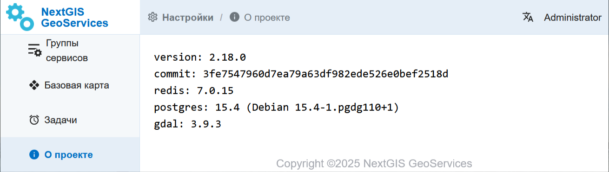

   Информация о версии компонентов NextGIS GeoServices on-premise

.. _geoserv_prem_set_users:

Пользователи и группы пользователей
------------------------------------

Если управлять ГеоСервисами должно несколько человек с разными правами доступа, можно создать для них отдельных пользователей, имеющий разные возможности по настройке разделов.

Администратору доступна вся функциональность. Он может создавать, изменять и удалять пользователей и группы пользователей.

В разделе "Пользователи" показывается список созданных пользователей, по умолчанию в нём есть только один - Администратор.

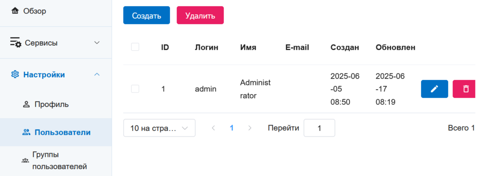

   Список пользователей

Чтобы создать нового пользователя, нажмите **Создать** и укажите:

* Логин
* Пароль
* Имя пользователя

Также можно указать: 

* Электронную почту 
* Группу, к которой он относится 

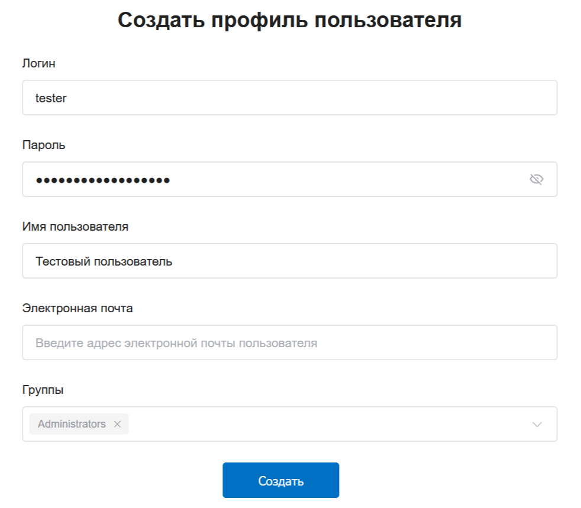

   Создание нового пользователя в NextGIS GeoServices on-premise

После успешного создания нового пользователя он появится в списке пользователей. 

Чтобы изменить данные пользователя, нажмите на кнопку с карандашом в правом конце строки.

Удалить пользователя можно несколькими способами: нажать на иконку с мусорным ведром в правом конце строки, или выделить пользователя и нажать кнопку **Удалить** над списком. Вторым способом можно удалять несколько пользователей сразу.

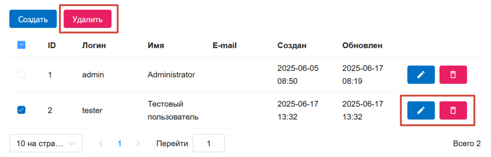

   Список пользователей и доступные действия с пользователем

При создании *группы пользователей* указывается её название и при необходимости выбираются пользователи из списка, которых нужно включить в эту группу.

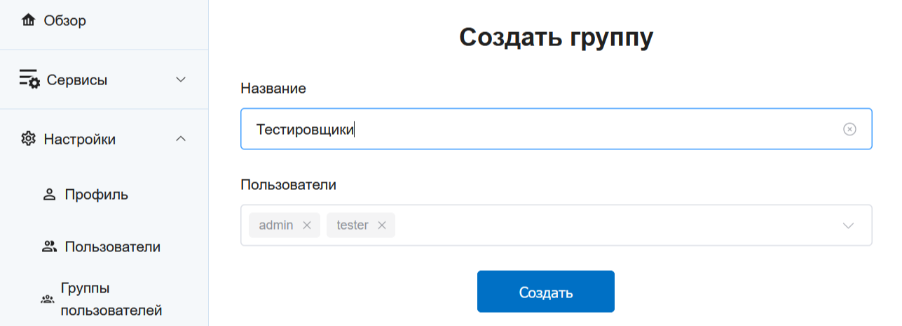

   Создание группы пользователей

Группы пользователей также можно редактировать и удалять.

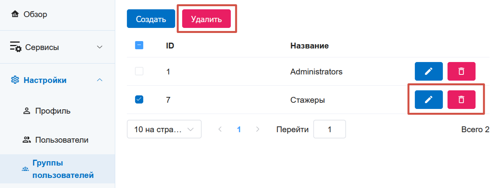

   Список групп пользователь и доступные действия
