.. _docs_geoserv_prem_settings:

Settings
============

.. _geoserv_prem_set_profile:

Profile
--------

**Profile** section contains user information. It is devided into two tabs: *My profile* and *My API keys*.

**My profile** tab has the following settings:

* Login
* Password (can be modified after you log in for the first time)
* Username
* E-mail

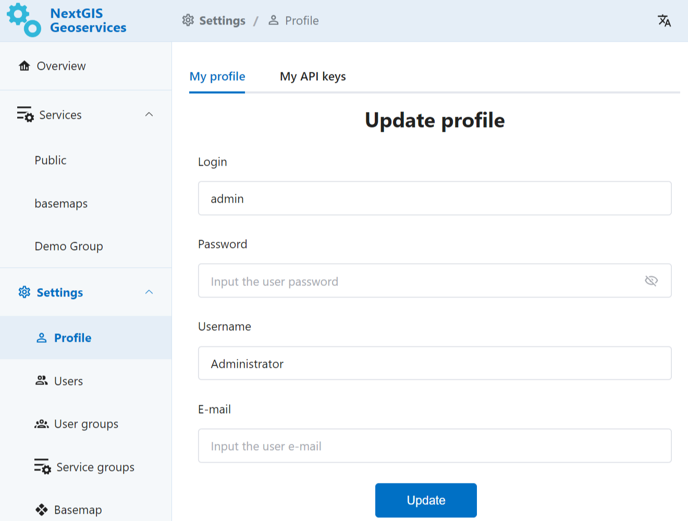

   My profile section in NextGIS GeoServices on-premise

**My API keys** are used for integration with other NextGIS services and external applications.
For instance, you'll need an API key to work
In this section Administrator can create and delete API keys.

While creating an API key, Administrator can set an expiration date for it.
Other API key settings include extent boundary, scale limits and origins.

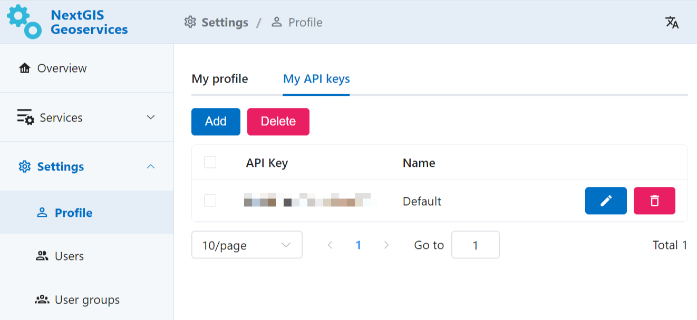

   My API keys section in NextGIS GeoServices on-premise

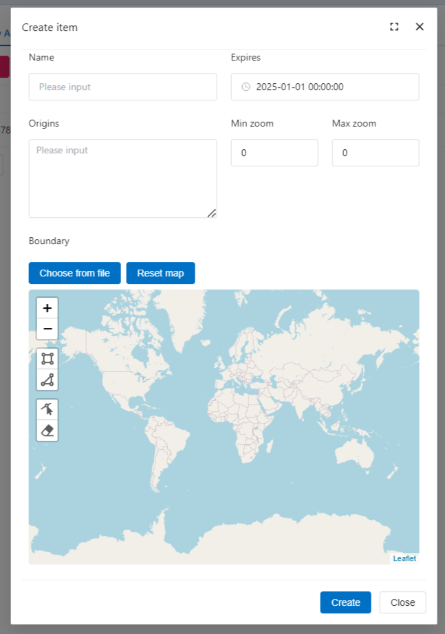

   Creating a new API key

.. _geoserv_prem_set_users:

Users and user groups
------------------------------------

Available settings depend on user access rights.

Administrator has full access and can create users, user groups, add users to the groups, delete and modify users and groups.

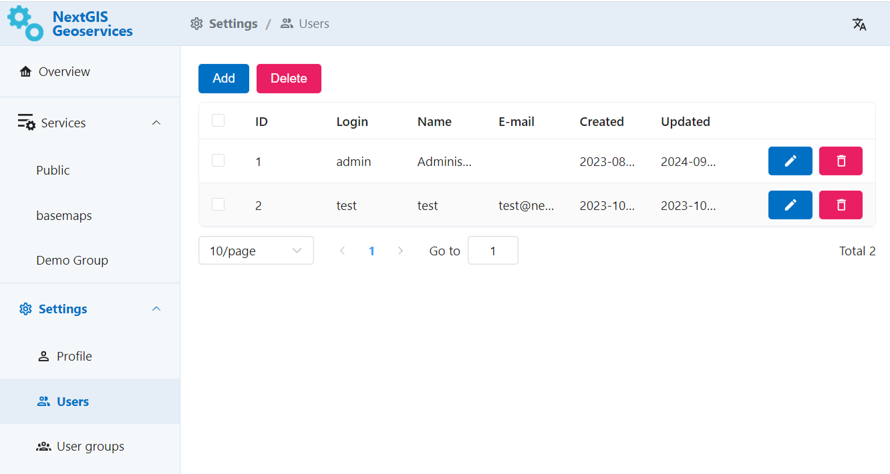

   Creating and deleting user in NextGIS GeoServices on-premise

To create a new user press **Add** and fill the following fields:

* Login
* Password
* Username
* E-mail
* Group to which the new user will be added (optional)

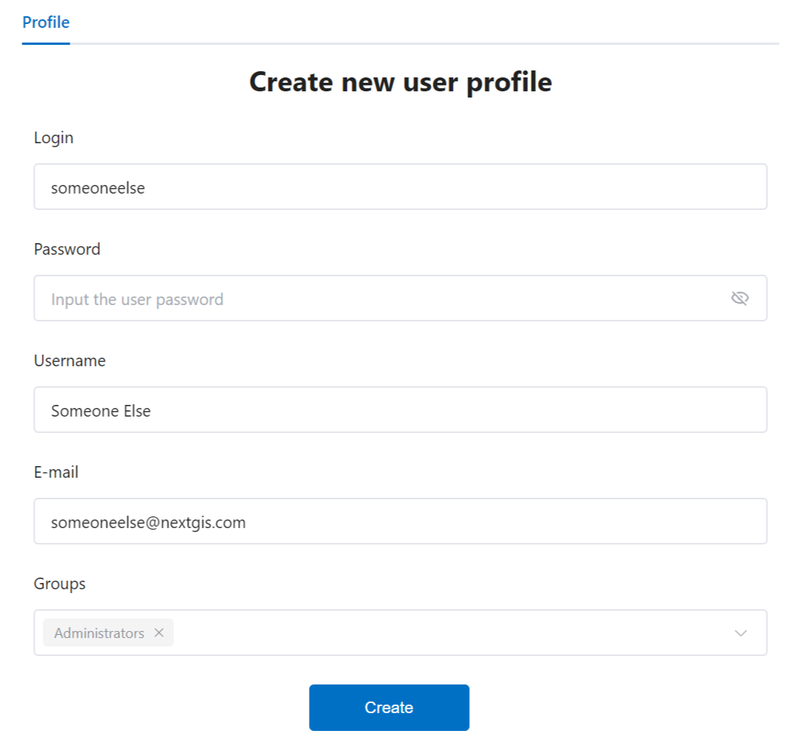

   Creating new user in NextGIS GeoServices on-premise

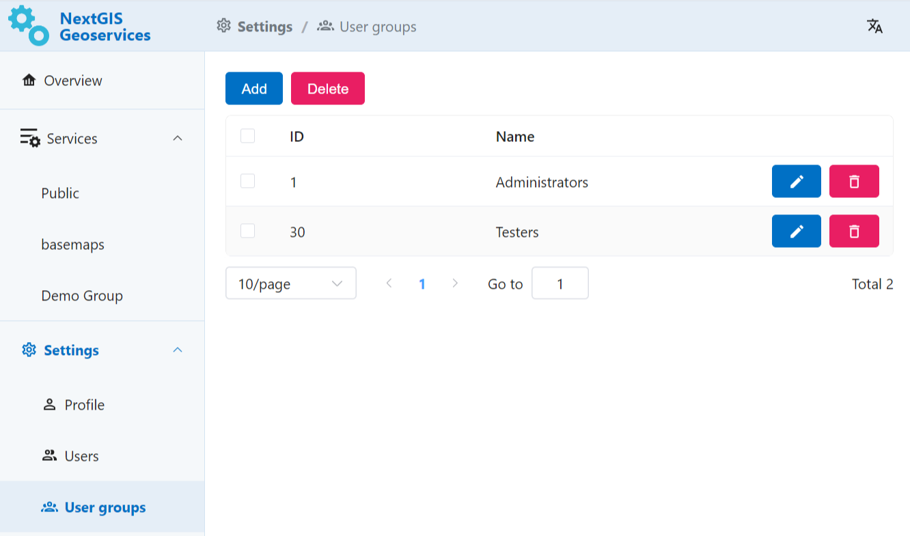

   List of user groups in NextGIS GeoServices on-premise

To create a User group, in the list of groups press **Add**. Enter the name for the group. You can select users to be included in the group from a dropdown menu.

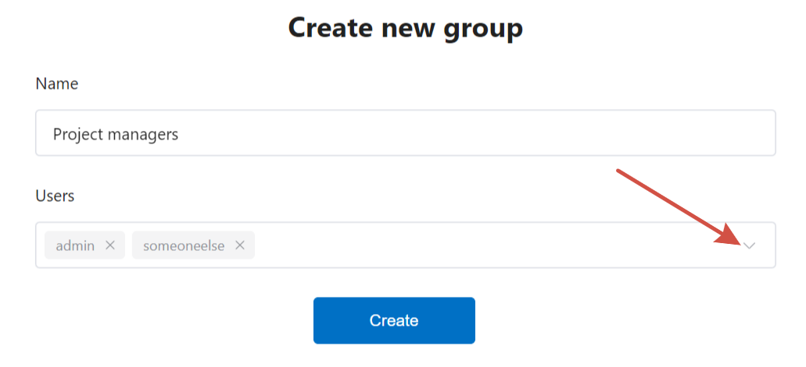

   Creating user group in NextGIS GeoServices on-premise

.. _geoserv_prem_set_basemap:

Basemap
--------------

In this section you can upload data that will be used for basemap services.

You can upload a PBF file (you can `order on NextGIS Data <https://data.nextgis.com/en/region/custom/base/>`_). Upload progress is displayed on the same tab. 

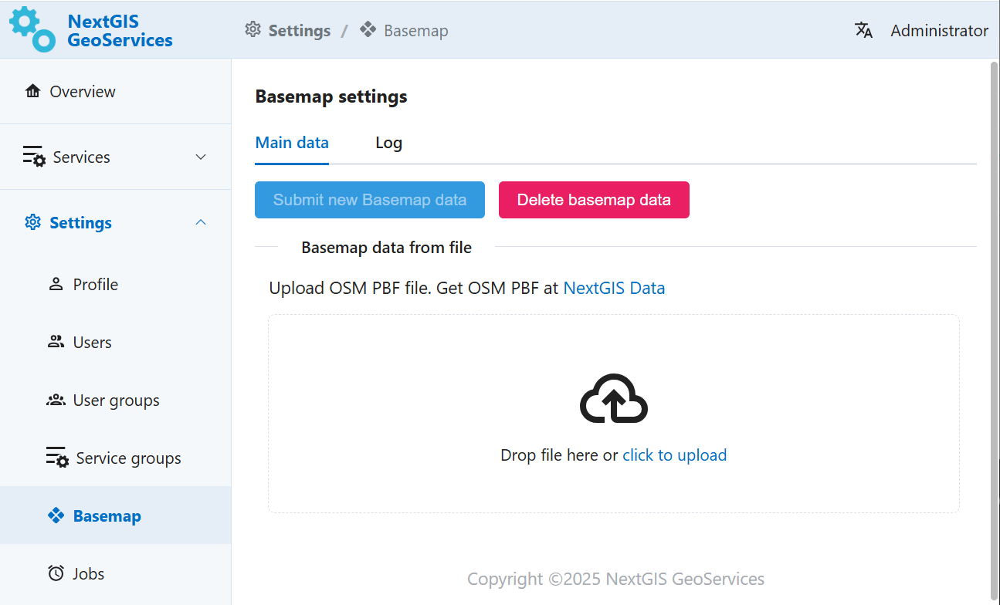

   Uploading data for basemap services

When the files are uploaded, press **Submit new basemap data** on the top of the page. 

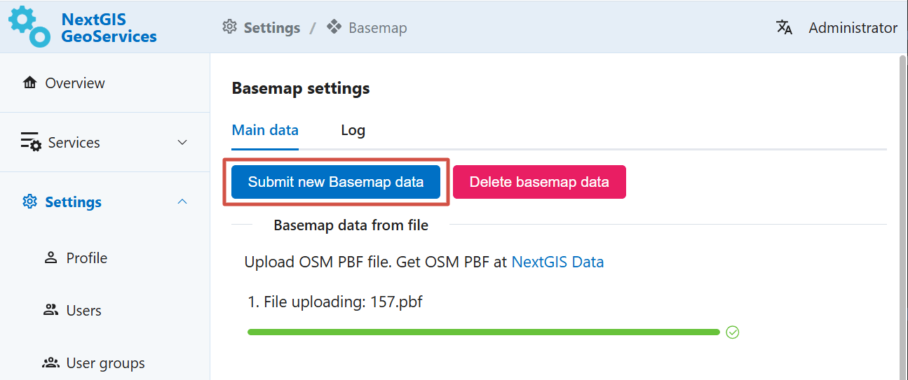

   Submitting new Basemap data

When the process is finished, it will be marked by a green dot in the Log .

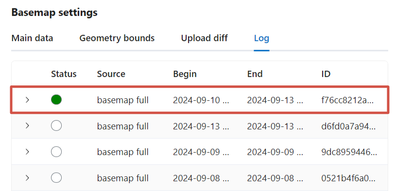

   Upload progress status in the Log tab

Default basemap that you configured can be found in the Public service group. Use the link for the tile service XYZ to add it to external software such as NextGIS Web or QGIS. 

You can use the basemap data to `create more services <https://docs.nextgis.com/docs_geoserv_prem/source/services.html#basemap-service>`_.

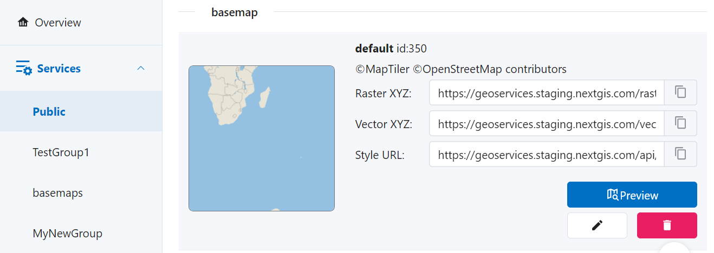

   Link to be used in external apps

.. _geoserv_prem_set_log:

Log
-------

The log registers data processing history and other actions performed by the app. 
Log entries include status, process source, beginning and end times, task ID and messages.

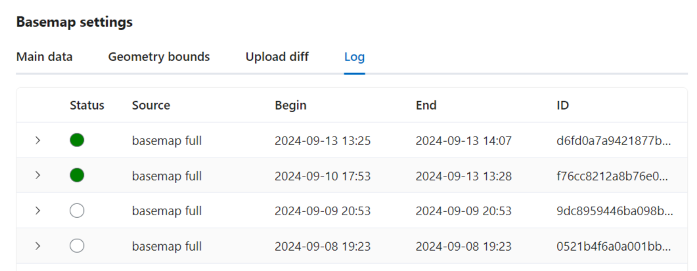

   Log tab in NextGIS GeoServices on-premise

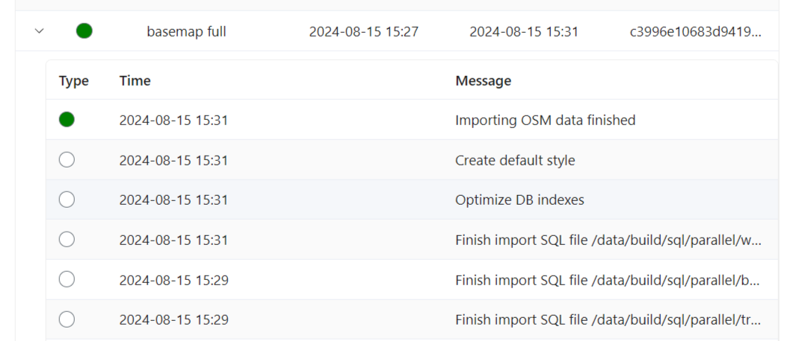

   Messages for a process in the log

.. _storage:

Storage
----------

In this section you can see the size of the cache stored in S3.

To start estimation process, click **Estimate storage**. Beside this button you'll see the date and time of the last estimation.

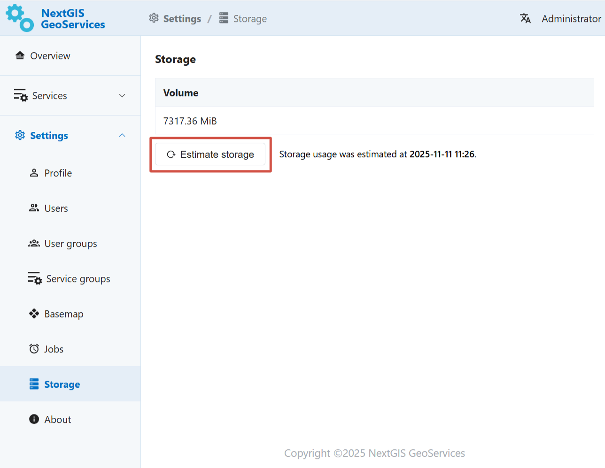

   Overall storage usage

Storage usage is estimated for all the cache combined as well as for individual services. To view the storage used by a particular service, open its preview. 

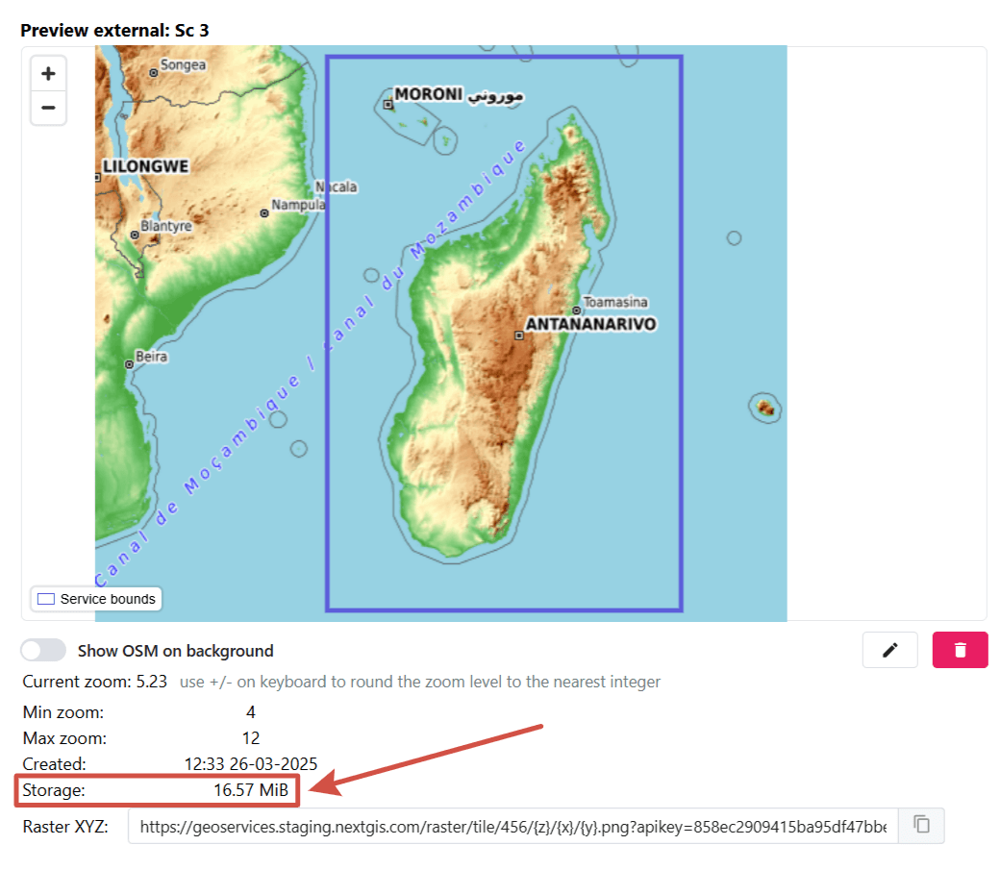

   Cache size of a service

About
-----------

This section has information on the current versions of the components.

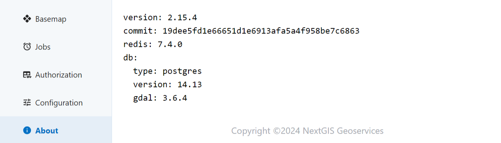

   Component version info in NextGIS GeoServices on-premise
 
