.. sectionauthor:: Роман Гайнуллов <roman.gainullov@nextgis.ru>

.. _docs_geoserv_prem_settings:

Настройки
============

.. _geoserv_prem_set_profile:

Профиль
--------

Основная информация о пользователе содержится в разделе **Профиль**, которая делится на две вкладки: *Мой профиль* и *Мои API-ключи*.

В **Моем профиле** находятся:

* Логин
* Пароль (можно сразу изменить)
* Имя пользователя
* Электронная почта

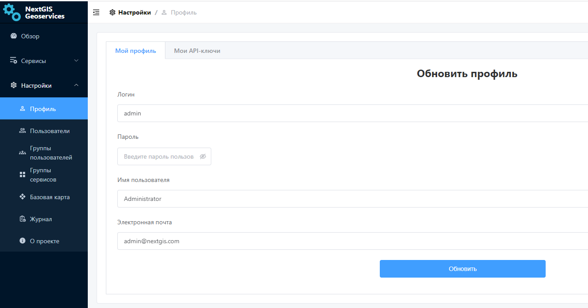

   Раздел "Мой профиль" в NextGIS GeoServices on-premise

**Мои API-ключи** служат для интеграции NextGIS GeoServices с другими сервисами NextGIS и внешними приложениями.
API ключ понадобится например для работы с публичной кадастровой картой в NextGIS Web, в настольном модуле NGQ Rosreestr Tools.
В данном разделе Администратор может создавать и удалять API-ключи.

Каждый API ключ может иметь свой срок действия, который определяется при его создании Администратором.
Здесь же задается охват, масштабные уровни и домены, на которые распространяется действие ключа.

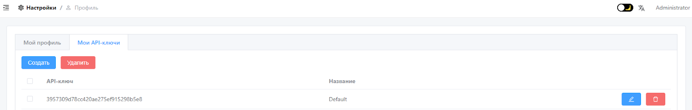

   Раздел "Мой API-ключи" в NextGIS GeoServices on-premise

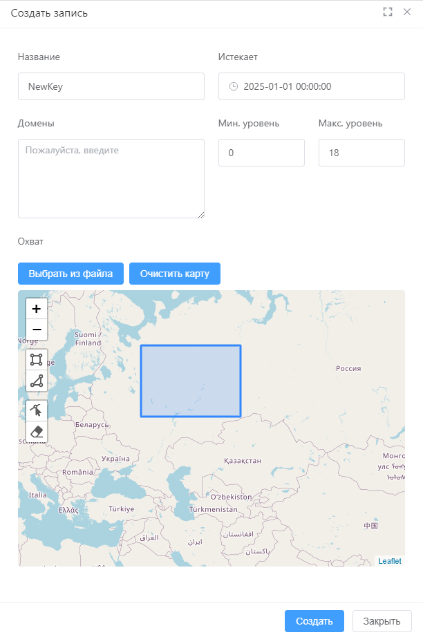

   Создание нового API-ключа

.. _geoserv_prem_set_basemap:

Базовая карта
--------------

В этом разделе загружаются данные OpenStreetMap, которые будут использоваться для создания сервисов базовой карты. На основе одного набора данных можно создавать сколько угодно сервисов разного охвата и масштабных уровней.

Данные для базовой карты можно загрузить двумя способами:

* Загрузить файл в формате PBF;
* Выбрать территорию из списка.

Когда все файлы загружены, нужно нажать **Отправить новые данные базовой карты**. Это запустит процесс формирования тайлового сервиса на их основе.

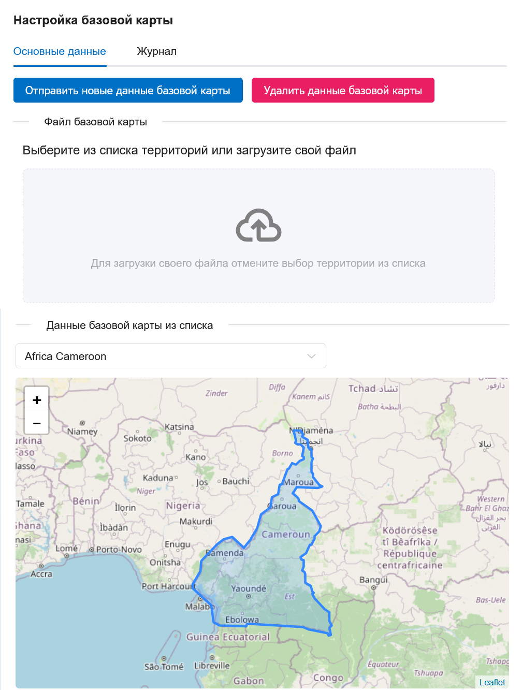

   Отправить новые данные для базовой карты

Процесс загрузки из файла PBF можно отслеживать на той же вкладке или на вкладке "Журнал". После успешного завершения полоса загрузки станет зеленой и в конце появится галочка.

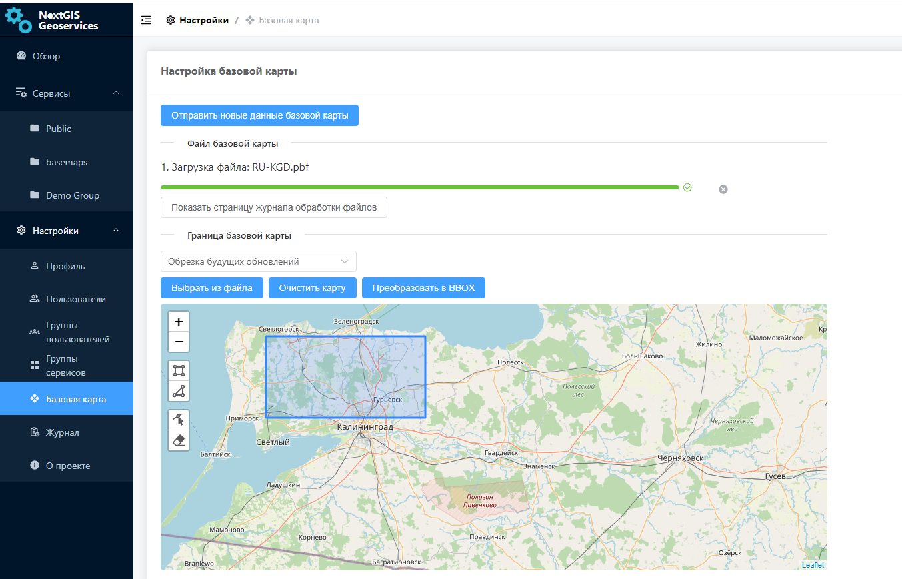

   Процесс загрузки успешно завершен

В Журнале индикатор перейдет в зеленый статус.

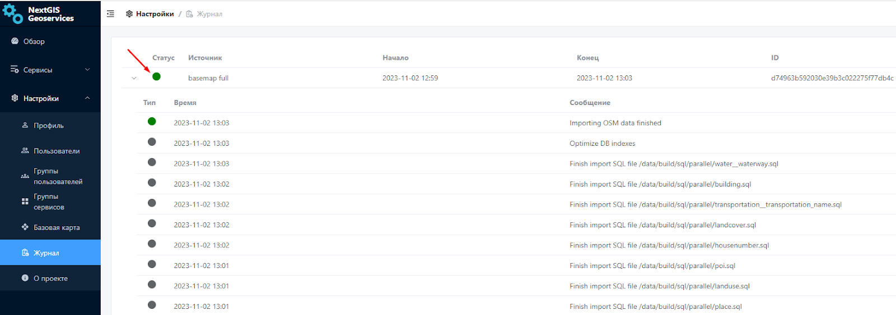

   Статус загрузки в журнале обработки файлов

Сервис базовой карты по умолчанию называется Default и располагается в разделе Сервисы в группе Public. Также можно `создавать сервисы <https://docs.nextgis.ru/docs_geoserv_prem/source/services.html#gs-prem-basemap>`_ с разными стилями и разным охватом на основе загруженных данных.

По ссылке тайловый сервис XYZ можно подключать во внешнее ПО, такое как NextGIS Web или QGIS. 

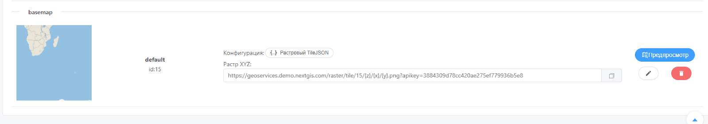

   Ссылка, которую можно использовать во внешних приложениях

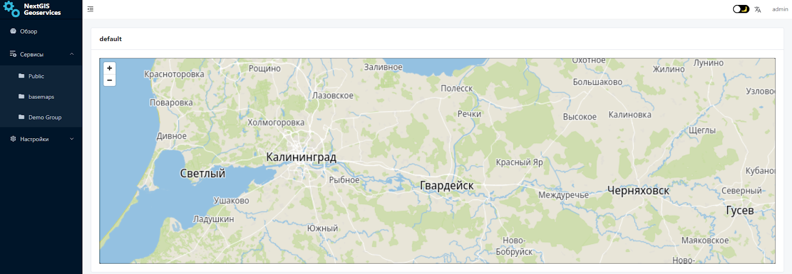

   Превью тайлового сервиса

.. _geoserv_prem_set_log:

Журнал
-------

В журнале фиксируется история обработки данных и других действий на стороне приложения. 
Фиксируется статус, название процесса, его начало и конец, id задачи и выводятся информационные сообщения.

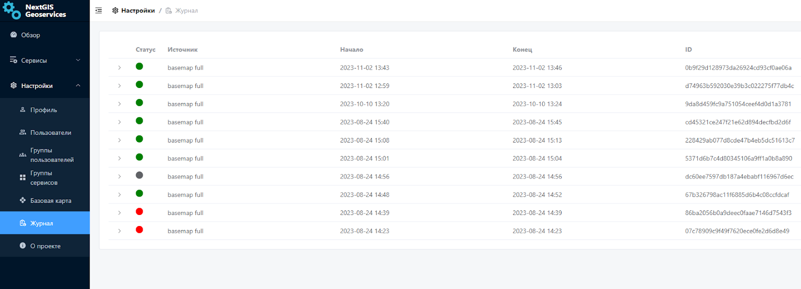

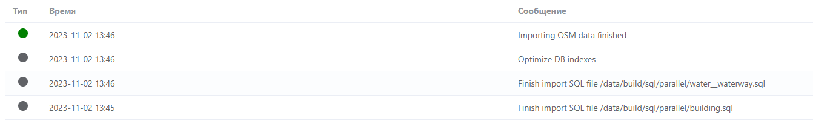

   Журнал регистрируемых действий в NextGIS GeoServices on-premise

.. _geoserv_prem_set_about:

О проекте
-----------

Раздел, в котором прописаны текущие версии компонентов.

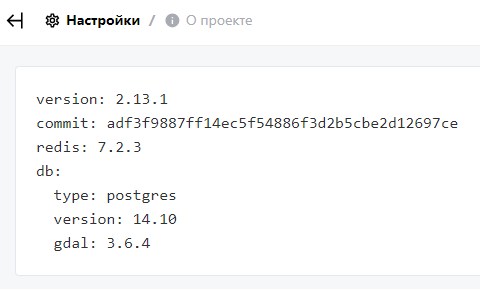

   Информация о версии компонентов NextGIS GeoServices on-premise

.. _geoserv_prem_set_users:

Пользователи и группы пользователей
------------------------------------

В зависимости от прав доступа пользователь имеет различный набор возможностей по настройке разделов Геосервисов.

Администратору доступен вся функциональность. Он может создавать пользователей, группы пользователей, добавлять пользователей в эти группы.
Также как удалять и изменять их.

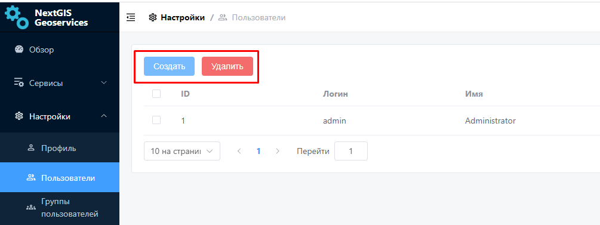

   Создание и удаление пользователя в NextGIS GeoServices on-premise

При создании нового пользователя указывается:

* Логин
* Пароль
* Имя пользователя
* Электронная почта
* Группа, к которой он относится (опционально)

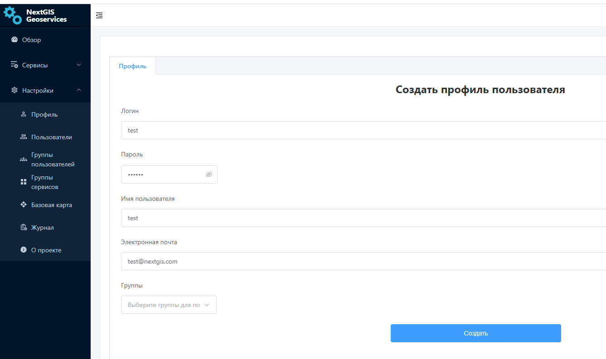

   Создание нового пользователя в NextGIS GeoServices on-premise

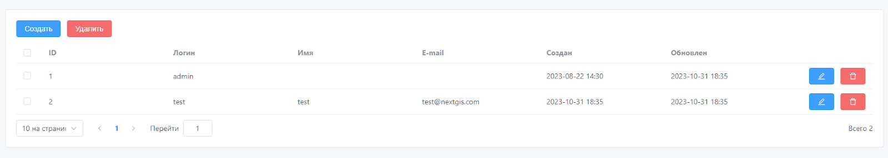

   Список пользователей в NextGIS GeoServices on-premise

При создании *группы пользователей* указывается её Название и при необходимости выбирается пользователь из списка, которого нужно включить в эту группу.

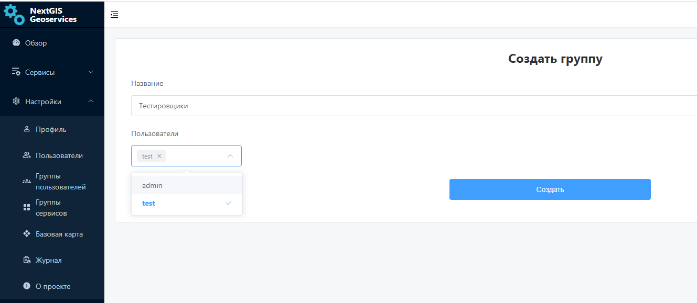

   Создание группы пользователей в NextGIS GeoServices on-premise
